# Tim Hecker: measured harmonic structures and production reconstructions

Radio Amor · Mirages · Mort aux Vaches

Audio-derived edition · 26 September 2026

This study analyzes all ten Radio Amor tracks, all eleven Mirages tracks, and the complete 40-minute Mort aux Vaches Bandcamp performance. It treats Mort aux Vaches as a live reworking of Mirages material and tests individual correspondences. The report contains actual pitch-component measurements, octave/register information, time windows, amplitude trajectories and reconstruction parameters. It replaces the earlier conceptual study.

The analysis covers the full duration of every stream computationally. Auxiliary audio-model checks used selected 20-second excerpts, not continuous human listening. The result is a measured production reference, **not an authenticated score or a recovered session file**. Dense distortion, resampling and overlapping decays prevent a reliable claim that every spectral component is an independently played note. Suggested source instruments and patch settings are explicitly proposals; historical equipment claims have separate sources.

## Reading the evidence

Three kinds of statements have different uses:

| Kind | What it establishes | Appropriate use |
| --- | --- | --- |
| Measured | A narrow peak, time-dependent energy, spectrum, or waveform correspondence in this stream | Acoustic matching and reconstruction targets |
| Inferred | A chord interpretation, bass role, likely pitch-field change, or source resemblance | Provisional conditioning labels, with uncertainty retained |
| Proposed | A piano/guitar/organ substitute, grain duration, routing or effect setting | A reproducible starting patch to optimize, not historical attribution |

Times are relative to each track. The live performance has one continuous clock because that is how the label's Bandcamp edition is presented. Sections are detected spectral-change windows, supplemented by 90-second caps; some short adjacent windows therefore are not separate musical phrases. Boundaries have 0.5-second analysis resolution and should not be mistaken for precisely annotated note attacks.

Pitch tables use C4 = MIDI 60 and A4 = 440 Hz. Each component is written as `note: Hz (cents)`; positive cents are sharp of equal temperament. C# and Db, F# and Gb are enharmonic equivalents. Frequencies are interpolated estimates from averaged 65,536-point spectra at 22,050 Hz: the raw bin spacing is about 0.336 Hz. Two decimal places are storage precision, not a claim of that much physical accuracy. Low-register cents are especially sensitive to windowing and unresolved beating.

**The pitch set in a row is a union over its window, not a block chord.** The companion JSON adds one actual half-second candidate snapshot per section; the NPZ files retain the whole activation trajectory. Even coincident peaks can be harmonics of one source. Use the analytical prose to choose a sparse reduction, and use activity data to preserve entrances and overlaps.

The dynamic columns report mean mono RMS dBFS, a **power-weighted** spectral centroid, and side/mid power ratio in dB. These are neither LUFS nor mastering prescriptions. Negative side/mid means more mid energy; it does not identify a reverb plugin. The period column gives a peak in a detrended amplitude-envelope autocorrelation, with its correlation in parentheses. It is a texture repetition candidate, **not a recovered BPM or meter**.

## Source editions and analysis coverage

The inputs are the publicly playable Bandcamp MP3-128 streams, decoded to 22,050-Hz stereo PCM for measurement. They are not lossless masters. Source byte hashes identify the exact analyzed streams in the dataset. Mastering, codec behavior and channel cancellation can affect results, especially noise and high frequencies. Original audio is not included in the deliverable.

- [Radio Amor — artist Bandcamp](https://timhecker.bandcamp.com/album/radio-amor)
- [Mirages — artist Bandcamp](https://timhecker.bandcamp.com/album/mirages)
- [Mort aux Vaches — label Bandcamp](https://mortauxvaches.bandcamp.com/album/mort-aux-vaches-tim-hecker)

| Album | Tracks/files | Duration | Analysis windows |
| --- | --- | --- | --- |
| Radio Amor | 10 | 58:21.5 | 98 |
| Mirages | 11 | 47:45.5 | 75 |
| Mort aux Vaches | 1 | 40:43.9 | 60 |

## Instruments, software and a reproducible signal path

In the contemporaneous 2004 interview Hecker names guitar, piano, processed samples, PCs, AudioMulch, Reaktor, pedals and a mixer. He describes Acéphale as developing from a Blur sample with his guitar added. He also describes composing from recorded live sessions. This supports an instrument-and-resampling workflow, but supplies neither a per-track instrument list nor exact presets. [Textura interview, October 2004](https://www.textura.org/archives/interviews/heckerinterview.htm).

In retrospect, Hecker identifies increasing Turbo RAT use on Mirages. His 2009 Max/MSP/Reaktor and synth/pedals/computer/mixer descriptions refer to that later period; they cannot establish the precise Mort aux Vaches rig. His contrast between studio construction and variable live performance supports treating the recordings as different arrangements. [Cokemachineglow interview, 2009](https://cokemachineglow.com/features/interview-timhecker-2009/).

Asked about Radio Amor in 2023, Hecker recalled a Reaktor object called “rampler i think.” Retain that qualification: this is useful evidence for Reaktor sample processing, not an exact ensemble version or preset. His 2023 description of multichannel stems, analog mixing, buffers and live synth input explains a later performance method, not a verified 2004 wiring diagram. [Artist AMA](https://www.reddit.com/r/indieheads/comments/136tic9/hi_its_tim_hecker_ama/).

There is no verified list of individual VSTs and parameter states for these albums. AudioMulch and Reaktor are environments, not proof of any particular effect chain. The following five patches can be implemented in a modular environment or equivalent sampler, filter, waveshaper and reverb modules. They are deliberately specified by DSP function so that a machine can reproduce the controls without guessing a commercial preset.

Use four independently rendered buses: **pitched body, clearer upper/attack layer, distorted resample, noise/residue**. Assign frequencies before distortion. Split the body before nonlinear processing; route the low anchor around the main distortion where the track recipe specifies it. Sum the distorted branch back under the clearer body. Put ambience after the branch sum, with a separately controllable send from the upper layer. This lets the measured bass, upper voice and noise envelope change independently.

For the proposed drive controls, define a repeatable reference implementation: normalize the source's active RMS to −18 dBFS, set gain `g = 10^(drive_dB/20)`, then use `tanh(g*x)`. Loudness-match the processed branch before setting its mix level. This is a controllable saturator, **not a Turbo RAT circuit model**. Use 4× oversampling for production. Filters in this reference patch are second-order Butterworth unless stated otherwise. Grain windows are Hann; overlap N means a grain starts every grain_duration/N. Position jitter is uniform over ±the listed value; seed = 260926. Grain pitch jitter starts at zero so that stochastic detuning does not erase measured tuning.

For P2, a resonator's −3 dB bandwidth is approximately center_frequency/Q. Q=12 is a broad initial coloration, not enough to synthesize a pure narrow peak by itself: add a sine component at the measured frequency when a stable narrow line is the target. For P4, the four amplitudes specify harmonics 1–4, normalized after summing. Do not infer that an observed third harmonic is a separate MIDI voice.

The quoted reverb decays are proposed RT60 targets; wet values are linear mix fractions. Predelay starts at 18 ms for P1/P3 and 0 ms for P2/P4/P5. Start the wet high cut at 5 kHz and the wet low cut at 150 Hz. These added controls are initialization choices. Measure the rendered result with the same feature extractor before calling the patch matched.

### P1 — Struck piano or plucked source with granular parallel

| Parameter | Proposed value |
| --- | --- |
| source_choices | self-recorded piano, clean electric-guitar pluck, additive struck tone |
| amp_attack_ms | 8 |
| amp_decay_s | 1.2 |
| amp_sustain | 0.12 |
| amp_release_s | 0.6 |
| granular_grain_ms | 110 |
| grain_overlap | 4 |
| position_jitter_ms | 35 |
| pitch_jitter_cents | 0 |
| parallel_drive_db | 9 |
| drive_post_lowpass_hz | 4800 |
| reverb_decay_s | 3.2 |
| reverb_wet | 0.24 |
| note | Keep a separate clearer attack branch. Timing comes from activity envelopes, not an assumed BPM. |

### P2 — Independent resonators and filtered noise

| Parameter | Proposed value |
| --- | --- |
| source_choices | sine/resonator bank at measured frequencies, sustained piano-tail sample |
| amp_attack_s | 1.4 |
| amp_release_s | 4.0 |
| noise_highpass_hz | 70 |
| noise_lowpass_hz | 3200 |
| resonator_Q | 12 |
| noise_relative_db | -18 |
| parallel_drive_db | 6 |
| reverb_decay_s | 4.5 |
| reverb_wet | 0.28 |
| note | Measure each voice tuning separately. No random detuning until the measured offsets are represented. |

### P3 — Distorted guitar-like body with preserved pitched branch

| Parameter | Proposed value |
| --- | --- |
| source_choices | clean guitar recording, plucked-string physical model, harmonic oscillator bank |
| amp_attack_ms | 20 |
| amp_release_s | 2.8 |
| drive_db | 18 |
| pre_drive_highpass_hz | 85 |
| post_drive_lowpass_hz | 4400 |
| clean_parallel_relative_db | -10 |
| granular_grain_ms | 85 |
| grain_overlap | 5 |
| reverb_decay_s | 2.7 |
| reverb_wet | 0.2 |
| note | Low sub layer bypasses the distortion. These are starting settings, not recovered Turbo RAT knob positions. |

### P4 — Organ-like sustained inner voices

| Parameter | Proposed value |
| --- | --- |
| source_choices | additive organ, sustained piano/guitar resample |
| harmonic_amplitudes | 1, 0.35, 0.18, 0.08 |
| amp_attack_s | 0.35 |
| amp_release_s | 3.5 |
| parallel_drive_db | 5 |
| lowpass_hz | 5200 |
| reverb_decay_s | 3.8 |
| reverb_wet | 0.25 |
| note | Do not retrigger common tones merely because bass or section label changes. |

### P5 — Band-limited nonpitched transition

| Parameter | Proposed value |
| --- | --- |
| source_choices | self-recorded radio-like noise, filtered noise |
| highpass_hz | 300 |
| lowpass_hz | 3000 |
| amp_attack_s | 0.1 |
| amp_release_s | 0.8 |
| reverb_decay_s | 1.6 |
| reverb_wet | 0.1 |
| note | No fabricated speech transcription; no MIDI targets from rejected noise-only pitch estimates. |

## Structural patterns that should survive reconstruction

### Radio Amor

The useful grammar is a combination of widely separated registers, recurring inner tones and local displacement. Song Of The Highwire Shrimper has an A/D/B/E family followed by a roughly semitone-lower Ab/Db/Bb/Eb family. Jimmy separates an Ab bass from high G; the major-seventh pitch-class tension becomes spacious because of the register gap. Spectral sustains a D-centered object while the upper material and masking change. These structures require independent voice envelopes, not one MIDI chord tied to one filter sweep.

I'm Transmitting Tonight offers a more conventional reduction: Bb-major-family material against Ab-major-family material. The upper D-to-C change matters, while delayed tails can temporarily retain both. The Star Compass moves through Db/Gb-related material, a local F-minor region and a Db/F-like ending. Trade Winds, White Heat reinterprets the Eb/Gb inner dyad: Bb/Db makes an Eb-minor-seven family, while B below it allows B major. This is parsimonious voice leading through common tones; a new full pad at every change would obscure it.

Several transitions carry a pitch object across a file boundary. The late G/Ab field of the opener relates to Jimmy; the later D/Eb field of Shipyard Of La Ceiba resembles the opening of Careless Whispers. These are measured pitch relationships, not proof that the same original sample was used. Azure Azure expands the paired D/Eb and G/Ab frictions into a long form. Build the semitone pairs as independent channels so their beating, masking and envelope relationship remain adjustable.

### Mirages

The harmonic objects are often obscured by low distorted energy, but there are concrete exceptions: Celestina's G/Bb/D/F/A collection; the later G2/Bb2/D3 triad in Aerial Light-Pollution Orange; Kaito's B-minor, F#/A and C-minor-seven regions; and Incurably Optimistic!'s recurring C/Eb inner voices. These anchors make a useful test set because a reconstruction can be assessed before adding the masking layers.

The Truth of Accountants exposes C/D/E upper material at its end, and the next track begins with related upper material before changing register into G minor. Preserve that source-bank continuity. Non Mollare is an A/E object whose third is not securely established; adding C merely because a classifier says A minor overdetermines the harmony. In Aerial Silver, neighboring G/Ab low components can be better modeled as a beating field than a functional chord progression.

Mirages also shows why “melody” must include voice persistence and emergence. A sustained source can expose an upper tone when distortion, filtering or an overlapping layer changes. That spectral emergence is observable; an original keyboard attack is not thereby proven. The machine representation therefore stores a continuous activation surface and proposed state palettes rather than pretending every bright line is a scored note.

### Rhythm, density and form

No reliable common meter has been established for the corpus. The 20-ms envelopes expose amplitude modulation and attacks; the 0.5-second pitch trajectories describe slower harmonic activity. Keep these separate. A 0.4-second amplitude repetition can arise from loop texture or beating without implying 150 BPM, and an attack detector responding five times per second does not mean five performed notes.

For reconstruction, preserve three clocks: source-note or source-fragment entrances; internal buffer/grain motion; and long arrangement changes. The analysis-window boundaries constrain the third clock. The NPZ activity and envelope data constrain the first two imperfectly. They do not establish grain size uniquely. The patch grain durations are initial hypotheses to be optimized against modulation and spectrum, not measurements of Hecker's buffer settings.

## Mort aux Vaches: comparison with the studio arrangements

This is analyzed as one performed sequence, not eleven concatenated Mirages tracks. The public edition supplies no internal track markers. The table below is a source-correspondence map, separate from the finer harmonic windows later in the report. Approximate regions can include overlays and transitions.

| Live region | Studio relationship | Evidence and limits |
| --- | --- | --- |
| 00:00–02:10 | Unassigned opening | No accepted exact source identity |
| Approximately 02:14–07:05 | Neither More nor Less candidate | Repeated pitch/time-feature retrieval; F/C material supports the hypothesis; no accepted waveform alignment |
| Approximately 07:31–12:53 | Aerial Silver candidate | Retrieval favors this source in several windows; noisy G/Ab fields can match other tracks |
| Approximately 14:20–19:05 | Celestina material | Strongly supported reuse in the tested early span; five aligned waveform windows maintain a consistent offset |
| Approximately 19:05–21:56 | Kaito-compatible B/D/F# material | Harmonic compatibility only; source identity remains unconfirmed |
| Approximately 21:42–25:00 | Counter Attack material | Strong feature and low-band waveform matches; repeated source cycles make a unique time map unavailable |
| Approximately 25:54–31:30 | Balkanize-You material | Strong reuse evidence; eight waveform windows from live 26:22 onward agree on a near-constant offset |
| Approximately 32:01–40:43.9 | C/Eb-related closing field | Several studio pitch fields resemble it; no accepted exact source assignment |

Gaps between these regions remain unassigned. Overlapping region ranges describe candidate material, not exclusive cuts. Radio Amor was included as a retrieval competitor; shared pitch content alone does not establish that Radio Amor material is performed here. No separate live Radio Amor album was analyzed, so this study cannot make a direct live-versus-studio claim for every Radio Amor track.

The accepted early Celestina comparisons imply `live_time ≈ studio_time + 859.11 s`. The Balkanize-You comparisons imply `live_time ≈ studio_time + 1554.42 s`. Those formulas apply to the tested spans, not automatically to the entire songs. Their near-constant offsets support retention of local source timing. They do not establish that all live layers run at the original rate or that nothing was re-performed.

The waveform check uses 25-second windows, resampled to 4,410 Hz, with a local ±4-second lag search. The strongest agreement is in 70–400 Hz; agreement in 400–1,500 Hz is generally much lower. Correlation is signed, and an absolute value is reported below to describe similarity despite polarity. Negative correlation is not proof of a particular mixer wiring or intentional inversion. These are corroborating checks on feature-retrieval candidates, not a calibrated identification classifier.

| Studio source | Studio start | Live aligned start | Offset seconds | Absolute low-band correlation |
| --- | --- | --- | --- | --- |
| Celestina | 00:08.0 | 14:27.1 | 859.119 | 0.572 |
| Celestina | 00:36.0 | 14:55.1 | 859.116 | 0.529 |
| Celestina | 00:52.0 | 15:11.1 | 859.114 | 0.592 |
| Celestina | 01:04.0 | 15:23.1 | 859.113 | 0.532 |
| Celestina | 01:20.0 | 15:39.1 | 859.111 | 0.373 |
| Counter Attack | 01:20.0 | 22:38.8 | 1278.769 | 0.427 |
| Counter Attack | 00:28.0 | 23:06.0 | 1357.971 | 0.568 |
| Counter Attack | 00:56.0 | 23:18.9 | 1342.949 | 0.434 |
| Counter Attack | 00:40.0 | 23:33.9 | 1373.920 | 0.620 |
| Counter Attack | 00:24.0 | 23:48.0 | 1403.961 | 0.610 |
| Counter Attack | 01:08.0 | 24:01.9 | 1373.917 | 0.490 |
| Counter Attack | 00:52.0 | 24:16.0 | 1403.961 | 0.413 |
| Balkanize-You | 00:28.0 | 26:22.4 | 1554.427 | 0.532 |
| Balkanize-You | 00:56.0 | 26:50.4 | 1554.424 | 0.493 |
| Balkanize-You | 01:24.0 | 27:18.4 | 1554.421 | 0.612 |
| Balkanize-You | 01:52.0 | 27:46.4 | 1554.418 | 0.629 |
| Balkanize-You | 02:20.0 | 28:14.4 | 1554.415 | 0.611 |
| Balkanize-You | 02:32.0 | 28:26.4 | 1554.414 | 0.718 |
| Balkanize-You | 02:48.0 | 28:42.4 | 1554.413 | 0.712 |
| Balkanize-You | 03:16.0 | 29:10.4 | 1554.410 | 0.721 |

Each row compares 25 seconds. Counter Attack offsets must not be collapsed to one time map. Full signed correlations and both frequency-band checks are in `waveform_match_checks.json`.

### Measured differences within the matched passages

| Source | Tested windows | Live − studio RMS dB | Live / studio power centroid | Live − studio side/mid dB |
| --- | --- | --- | --- | --- |
| Celestina | 5 | -17.59 | 1.48× | +0.38 |
| Counter Attack | 7 | -12.79 | 1.37× | +0.75 |
| Balkanize-You | 8 | -11.26 | 0.56× | -2.59 |

These are medians across the tested, sometimes overlapping 25-second windows; they are not whole-album statistics or independent experimental replicates. Positive RMS means the live stream is louder in the mono measurement. A centroid ratio above one means more high-frequency weighting in this particular power-based metric; a positive side/mid change means a larger side/mid ratio. The differences include mastering, processing and overlays, so they cannot be uniquely attributed to a filter, distortion pedal or room. Use them as local reconstruction targets after preserving the supported source timing. In a live reconstruction, expose independent body gain, distorted-branch gain, high-frequency balance and side level; fit these controls rather than stretching the source merely to make it sound different.

## Radio Amor: track-by-track measured reconstruction

### 01. Song Of The Highwire Shrimper — 07:24.3

**Defining structure: A suspended field and semitone displacement.** From 00:22.5 to 02:14, A2 anchors upper B4, E5 and A4, with D3 also present. This supports an A-centered suspended/add9 reading more directly than an unqualified A-minor label: the defining third is not consistently prominent. At 02:14 the prominent group shifts toward Ab2, Db3, Bb4 and Eb5, approximately a semitone below the earlier A/D/B/E group. Around 03:11.5 the A/E/B group returns. From 04:46 onward the balance changes again toward Db/Eb/C and then F-related material. Treat these as changes of pitch field, not a single four-chord loop repeated across the whole track.

**Reconstruction:** Use the P1 struck-source patch for B4/E5/A4, with a separate low A2/D3 layer. Keep the upper pitches independent of bass distortion. In the Ab/Db span transpose the A/D/B/E source family down one semitone before resampling; preserve separate detuning offsets from the table. Replace the field according to the measured section boundaries rather than applying an indiscriminate pitch LFO. The last ten seconds form a different Ab/G pitch texture leading toward Jimmy. Patch P1 is a proposed source/process initialization; per-track original instrument identity remains unknown unless independently cited above.

| Window / time | Supported pitch components: Hz (cents) | Key-profile fit, not confirmed key | Representative 0.5-s candidate snapshot |
| --- | --- | --- | --- |
| 01 · 00:00.0–00:22.5 | G1: 49.48 (+16.9); F2: 86.15 (-23.2); D4: 300.64 (+40.6); Ab4: 410.76 (-19.1); F6: 1407.82 (+13.5) | F minor (r=0.60) | 00:09.0: G1, F6, F2, Ab4, D4 |
| 02 · 00:22.5–00:55.5 | A2: 110.94 (+14.8); D3: 146.12 (-8.5); B3: 245.13 (-12.7); A4: 442.02 (+7.9); B4: 496.51 (+9.2); E5: 662.78 (+9.2) | A minor (r=0.63) | 00:44.5: B4, A2, E5, B3 |
| 03 · 00:55.5–01:21.5 | G2: 96.18 (-32.4); A2: 110.64 (+10.1); D3: 146.46 (-4.4); A4: 442.42 (+9.5); B4: 495.99 (+7.4); E5: 663.17 (+10.2) | A minor (r=0.71) | 01:20.0: E5, B4, A2 |
| 04 · 01:21.5–01:40.5 | E2: 80.78 (-34.4); A2: 111.14 (+17.9); C3: 127.92 (-38.7); B3: 247.01 (+0.5); C4: 261.20 (-2.8); A4: 442.41 (+9.4); B4: 495.97 (+7.3) | A minor (r=0.81) | 01:29.5: B4, A2, C4, E2, C3, B3 |
| 05 · 01:40.5–02:14.0 | A1: 55.64 (+20.1); A2: 110.01 (+0.2); D3: 146.83 (-0.0); C4: 263.69 (+13.6); E4: 331.28 (+8.7); B4: 496.17 (+8.0); E5: 662.45 (+8.4) | A minor (r=0.77) | 02:04.0: E5, A2, B4, D3, E4, A1, C4 |
| 06 · 02:14.0–02:44.0 | Ab2: 103.63 (-3.2); C#3: 137.98 (-7.6); Bb4: 468.80 (+9.8); C#5: 556.80 (+7.6); Eb5: 626.10 (+10.7) | Ab major (r=0.76) | 02:18.0: Eb5, Bb4, C#3, Ab2 |
| 07 · 02:44.0–03:11.5 | Bb2: 114.53 (-30.1); C#3: 137.07 (-19.2); Bb4: 469.04 (+10.6); C5: 526.13 (+9.5); Eb5: 625.46 (+8.9); F5: 702.61 (+10.3) | C minor (r=0.65) | 03:00.0: C5, Eb5, Bb4 |
| 08 · 03:11.5–03:29.0 | D2: 73.72 (+7.2); A2: 110.58 (+9.1); D3: 146.68 (-1.9); A4: 441.88 (+7.4); B4: 496.63 (+9.6); E5: 662.91 (+9.6) | E major (r=0.68) | 03:21.5: E5, A4, D2 |
| 09 · 03:29.0–03:44.0 | G2: 99.30 (+22.8); A2: 110.33 (+5.2); A3: 219.64 (-2.8); B3: 248.52 (+11.0); A4: 441.50 (+5.9); B4: 495.81 (+6.8); E5: 662.38 (+8.2) | A minor (r=0.78) | 03:40.5: A4, A2, B3, E5 |
| 10 · 03:44.0–04:46.0 | A2: 111.03 (+16.2); C3: 128.16 (-35.5); E3: 166.54 (+18.1); B3: 247.30 (+2.5); B4: 495.38 (+5.2) | E major (r=0.55) | 04:12.5: B3, B4, A2, C3, E3 |
| 11 · 04:46.0–06:16.0 | C#2: 70.62 (+32.7); D2: 71.62 (-42.9); C#3: 141.99 (+41.9); Eb3: 155.45 (-1.2); Eb4: 310.27 (-4.8); C5: 524.66 (+4.6); Eb5: 626.13 (+10.7) | Ab major (r=0.61) | 05:11.0: Eb5, C#2, D2, Eb4 |
| 12 · 06:16.0–07:14.0 | F2: 89.16 (+36.4); F3: 178.24 (+35.6); Bb3: 234.48 (+10.4); E4: 329.58 (-0.2); Ab4: 415.55 (+1.0); Bb4: 468.30 (+7.9); Eb5: 623.73 (+4.1); F5: 702.69 (+10.5) | F minor (r=0.72) | 06:30.5: F5, F3, F2, Bb4, Bb3 |
| 13 · 07:14.0–07:24.3 | G1: 48.46 (-19.2); Ab1: 51.76 (-5.0); Eb2: 76.07 (-38.4); G2: 97.30 (-12.3); Ab2: 102.87 (-16.1); G5: 774.85 (-20.3); C6: 1042.66 (-6.4); D6: 1162.24 (-18.4) | Ab major (r=0.52) | 07:21.5: Ab2, G5, Ab1, D6, G2, C6 |

**Measured dynamics and texture.** Use these as section targets; retain the full envelopes for within-section motion.

| Window | RMS dBFS | Power centroid Hz | Side/mid dB | Flatness | Envelope period s (r) |
| --- | --- | --- | --- | --- | --- |
| 1 | -28.34 | 1482.5 | -6.76 | 0.0206 | 0.90 (0.16) |
| 2 | -13.13 | 555.5 | -12.56 | 0.001 | 0.58 (0.13) |
| 3 | -10.53 | 556.3 | -12.17 | 0.0001 | 0.58 (0.24) |
| 4 | -11.61 | 346.5 | -13.17 | 0.0003 | 0.64 (0.38) |
| 5 | -13.05 | 457.8 | -8.64 | 0.0002 | 3.82 (0.14) |
| 6 | -11.2 | 539.0 | -11.79 | 0.0004 | 3.74 (0.11) |
| 7 | -14.0 | 617.4 | -9.01 | 0.0001 | 3.16 (0.10) |
| 8 | -13.45 | 624.2 | -10.87 | 0.0001 | 0.62 (0.23) |
| 9 | -12.76 | 484.7 | -9.13 | 0.0001 | 0.52 (0.33) |
| 10 | -12.14 | 359.1 | -7.01 | 0.0001 | 3.72 (0.06) |
| 11 | -14.71 | 627.4 | -5.75 | 0.0004 | 0.24 (0.15) |
| 12 | -24.51 | 730.6 | -7.34 | 0.0035 | 1.94 (0.10) |
| 13 | -29.07 | 1008.8 | -6.53 | 0.0192 | 0.18 (0.32) |

The snapshot selects the densest supported candidate frame, not a typical or definitive chord. The pitch plot below is gated by the spectral-component mask; blank regions mean unresolved pitch evidence, not necessarily silence.

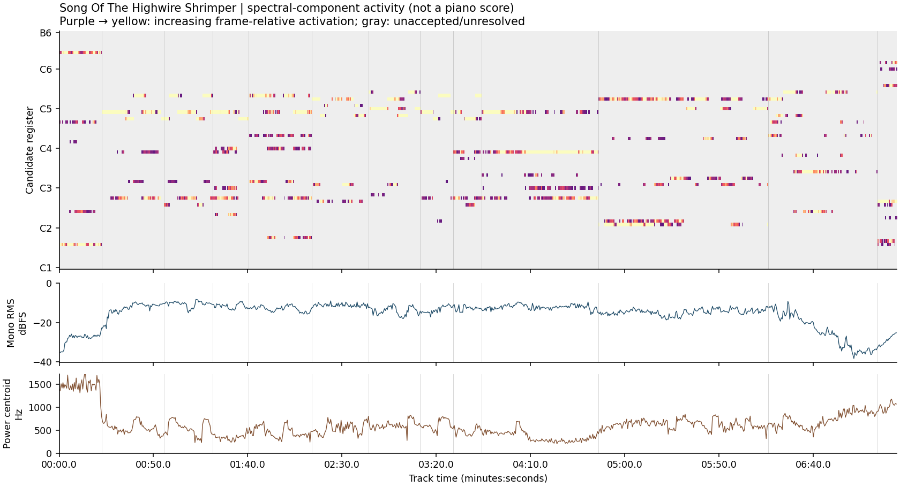

### 02. (They Call Me) Jimmy — 04:52.2

**Defining structure: Ab bass against G in a distant register.** The persistent relationship is low Ab2, often with Ab1 or Eb2, against high G5 and intermittent D6/C6. G above Ab is a major-seventh pitch-class relationship, stretched across several octaves. That separation is more specific than a generic minor pad. The changing weight of G1 versus Ab1/Ab2 destabilizes the bass center. The detector alternates Ab-major and G-minor profiles, but that does not establish repeated modulations: the same competing G/Ab material can cause both labels.

**Reconstruction:** Build a low resonant Ab2/Eb2 layer and a separate breathy upper G5 lane. Begin with P2, not a stock full choir chord. Preserve the dissonant G/Ab relationship rather than quantizing all layers to Ab major. Introduce D6 and C6 only where supported by the event map. Use broad vowel-like EQ on the upper layer, 1.2–2.5 s attack and 3–6 s release, with the bass much less diffuse. Those envelopes are proposed reconstruction controls. Patch P2 is a proposed source/process initialization; per-track original instrument identity remains unknown unless independently cited above.

| Window / time | Supported pitch components: Hz (cents) | Key-profile fit, not confirmed key | Representative 0.5-s candidate snapshot |
| --- | --- | --- | --- |
| 01 · 00:00.0–01:30.0 | G2: 100.43 (+42.5); Ab2: 101.96 (-31.4); G5: 781.10 (-6.4); D6: 1160.33 (-21.2) | Ab major (r=0.50) | 01:17.5: Ab2, G5, D6 |
| 02 · 01:30.0–01:36.5 | G1: 49.72 (+25.3); Ab1: 51.67 (-8.2); Eb2: 76.98 (-18.0); G2: 100.21 (+38.6); Ab2: 102.95 (-14.6); G5: 782.17 (-4.0); D6: 1160.68 (-20.7) | Ab major (r=0.56) | 01:34.0: Ab2, Ab1, G5, G1, G2 |
| 03 · 01:36.5–01:57.5 | G1: 50.00 (+35.1); Eb2: 77.77 (-0.3); Ab2: 102.73 (-18.3); G5: 779.32 (-10.3); C6: 1040.02 (-10.8); D6: 1160.17 (-21.5) | Ab major (r=0.50) | 01:53.5: Ab2, G5, G1, C6, Eb2 |
| 04 · 01:57.5–02:17.0 | G1: 49.71 (+25.0); D2: 73.51 (+2.2); Eb2: 76.42 (-30.5); Ab2: 102.79 (-17.4); D5: 582.77 (-13.5); G5: 777.76 (-13.8) | G minor (r=0.65) | 01:59.5: G1, Eb2, G5, D5, D2, Ab2 |
| 05 · 02:17.0–02:51.5 | Eb1: 38.66 (-10.1); F#1: 46.21 (-1.5); Ab1: 51.24 (-22.7); A1: 54.11 (-28.2); Eb2: 77.14 (-14.3); Ab2: 102.37 (-24.5); G5: 778.69 (-11.7); C6: 1043.24 (-5.4) | Ab major (r=0.58) | 02:34.5: Ab1, G5, Ab2, A1 |
| 06 · 02:51.5–04:00.5 | G1: 50.03 (+35.9); G2: 100.43 (+42.5); Ab2: 103.24 (-9.8); G5: 778.45 (-12.3) | Ab major (r=0.51) | 03:59.0: Ab2, G5, G1, G2 |
| 07 · 04:00.5–04:28.5 | G1: 50.02 (+35.6); C2: 65.95 (+14.4); Ab2: 103.64 (-3.1); G5: 779.23 (-10.5); D6: 1166.57 (-12.0) | G minor (r=0.44) | 04:18.5: G5, G1, Ab2 |
| 08 · 04:28.5–04:52.2 | G1: 50.00 (+35.0); G2: 100.18 (+38.1); Ab2: 101.63 (-37.0); G5: 779.85 (-9.2) | Ab major (r=0.37) | 04:40.0: Ab2, G1, G5, G2 |

**Measured dynamics and texture.** Use these as section targets; retain the full envelopes for within-section motion.

| Window | RMS dBFS | Power centroid Hz | Side/mid dB | Flatness | Envelope period s (r) |
| --- | --- | --- | --- | --- | --- |
| 1 | -14.22 | 804.5 | -5.21 | 0.0045 | 0.26 (0.08) |
| 2 | -12.66 | 640.7 | -3.72 | 0.0016 | 0.24 (0.17) |
| 3 | -16.79 | 780.2 | -2.41 | 0.0031 | 0.96 (0.11) |
| 4 | -18.77 | 653.3 | -3.49 | 0.0006 | 0.20 (0.11) |
| 5 | -18.88 | 751.7 | -2.68 | 0.0014 | 2.60 (0.07) |
| 6 | -13.04 | 414.4 | -3.57 | 0.0013 | 3.52 (0.12) |
| 7 | -12.98 | 717.2 | -3.68 | 0.0024 | 1.44 (0.16) |
| 8 | -13.11 | 630.3 | -3.51 | 0.0042 | 0.34 (0.11) |

The snapshot selects the densest supported candidate frame, not a typical or definitive chord. The pitch plot below is gated by the spectral-component mask; blank regions mean unresolved pitch evidence, not necessarily silence.

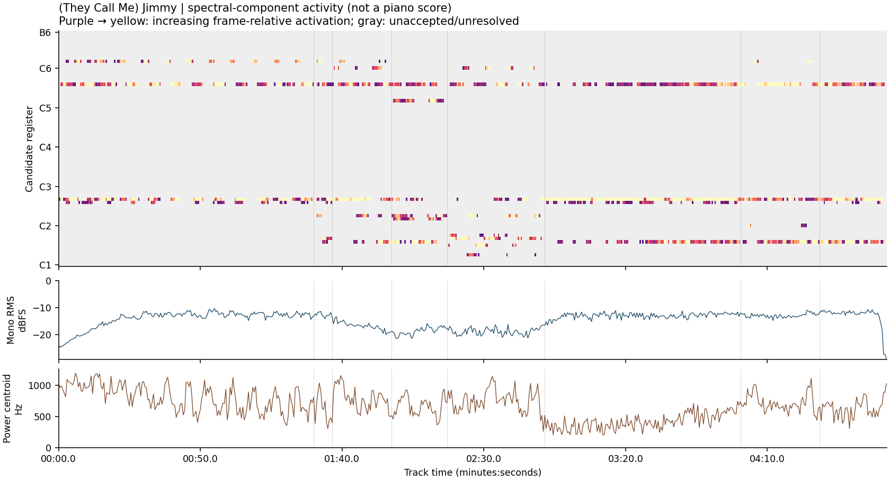

### 03. Spectral — 08:09.3

**Defining structure: D pedal with an unresolved third.** D2 is the most persistent narrow pitch component through almost the entire pitched portion; D1, G2 and A4/A5 appear with it. The D-major profile often wins because of the distribution of partials, but most section summaries do not establish a stable F# as an independent voice. Model the long span as a D-centered pedal with fifth/fourth relations until the third is locally demonstrated. The final 16.8 seconds have a different spectrum and should not inherit the earlier key label automatically.

**Reconstruction:** Use P2 for D2, optional supported D1, and a separate G2/A upper layer. Keep harmonic rhythm slow and automate articulation and masking instead. Use the source event map for returns of upper A, while the D component remains continuous where its activation permits. The published seven-part analysis is a separate perceptual segmentation; the finer measured boundaries here are spectral windows, not replacements for that musical reading. Patch P2 is a proposed source/process initialization; per-track original instrument identity remains unknown unless independently cited above.

| Window / time | Supported pitch components: Hz (cents) | Key-profile fit, not confirmed key | Representative 0.5-s candidate snapshot |
| --- | --- | --- | --- |
| 01 · 00:00.0–00:44.5 | D2: 74.97 (+36.2); Eb2: 75.87 (-43.1); G2: 98.05 (+0.9); A5: 886.88 (+13.5) | D major (r=0.72) | 00:38.0: D2, A5, G2 |
| 02 · 00:44.5–01:23.0 | C#2: 71.04 (+43.0); D2: 72.56 (-20.2); A5: 881.11 (+2.2) | D major (r=0.80) | 00:46.0: D2, A5, C#2 |
| 03 · 01:23.0–01:50.5 | D1: 36.68 (-1.4); D2: 73.37 (-1.1); A4: 444.85 (+19.0) | D major (r=0.73) | 01:49.0: D2, D1, A4 |
| 04 · 01:50.5–02:13.5 | D1: 36.71 (+0.0); D2: 73.42 (+0.2); G2: 97.99 (-0.2) | D major (r=0.75) | 02:13.0: D2, D1 |
| 05 · 02:13.5–02:29.0 | D1: 36.72 (+0.3); D2: 73.43 (+0.3); A2: 109.98 (-0.3) | D major (r=0.76) | 02:27.0: D2, D1, A2 |
| 06 · 02:29.0–02:44.5 | D1: 36.71 (+0.1); D2: 73.42 (+0.1) | D major (r=0.69) | 02:39.0: D2, D1 |
| 07 · 02:44.5–03:26.5 | D1: 36.71 (+0.1); D2: 73.42 (+0.2); G2: 98.00 (+0.0) | D major (r=0.75) | 03:03.5: D1, D2 |
| 08 · 03:26.5–04:07.5 | D1: 36.70 (-0.2); C2: 65.68 (+7.3); D2: 73.41 (-0.2); G2: 98.05 (+1.0); A5: 885.21 (+10.2) | D major (r=0.77) | 04:01.5: D2, G2, A5, C2 |
| 09 · 04:07.5–04:35.0 | C2: 65.56 (+4.1); D2: 73.43 (+0.2); G2: 97.99 (-0.2) | D major (r=0.71) | 04:31.0: D2, G2 |
| 10 · 04:35.0–04:54.5 | D1: 36.71 (+0.1); D2: 73.41 (-0.2); G2: 98.00 (-0.0); A4: 442.47 (+9.7) | D major (r=0.79) | 04:43.0: D2, D1, A4 |
| 11 · 04:54.5–06:24.5 | D1: 36.71 (+0.1); D2: 73.39 (-0.7) | D major (r=0.72) | 06:08.0: D2, D1 |
| 12 · 06:24.5–06:33.5 | D2: 73.40 (-0.4); A4: 442.26 (+8.9) | D major (r=0.80) | 06:27.0: D2, A4 |
| 13 · 06:33.5–07:17.0 | D2: 73.40 (-0.3) | Withheld: insufficient supported components | 06:33.5: D2 |
| 14 · 07:17.0–07:52.5 | D2: 73.43 (+0.4); A4: 441.19 (+4.7) | D minor (r=0.78) | 07:47.0: D2, A4 |
| 15 · 07:52.5–08:09.3 | Bb2: 116.70 (+2.4); Eb3: 154.47 (-12.2); Bb3: 233.94 (+6.3); D4: 295.99 (+13.6); Bb4: 478.27 (+44.4); B4: 481.96 (-42.3); D5: 587.12 (-0.6); B5: 989.12 (+2.4) | Bb major (r=0.54) | 07:54.0: D5, B4, Bb4, B5, Bb2, Eb3, Bb3 |

**Measured dynamics and texture.** Use these as section targets; retain the full envelopes for within-section motion.

| Window | RMS dBFS | Power centroid Hz | Side/mid dB | Flatness | Envelope period s (r) |
| --- | --- | --- | --- | --- | --- |
| 1 | -21.95 | 626.2 | -0.67 | 0.0055 | 1.88 (0.11) |
| 2 | -16.32 | 637.2 | -3.31 | 0.0023 | 2.30 (0.09) |
| 3 | -14.79 | 325.0 | 1.3 | 0.0004 | 3.12 (0.28) |
| 4 | -10.51 | 196.1 | -6.68 | 0.0001 | 3.12 (0.19) |
| 5 | -8.01 | 145.2 | -7.79 | 0.0 | 1.92 (0.15) |
| 6 | -9.11 | 97.1 | -8.2 | 0.0 | 0.42 (0.26) |
| 7 | -12.33 | 326.7 | -4.88 | 0.0002 | 0.18 (0.13) |
| 8 | -12.33 | 459.1 | -2.7 | 0.0001 | 3.12 (0.19) |
| 9 | -12.92 | 340.9 | -4.17 | 0.0002 | 0.20 (0.27) |
| 10 | -14.9 | 290.1 | -5.56 | 0.0002 | 0.22 (0.17) |
| 11 | -17.35 | 177.4 | 0.48 | 0.0001 | 0.20 (0.24) |
| 12 | -13.92 | 310.2 | 0.6 | 0.0001 | 2.40 (0.32) |
| 13 | -21.67 | 301.4 | 3.25 | 0.0016 | 1.48 (0.43) |
| 14 | -22.79 | 479.5 | 2.49 | 0.0042 | 1.48 (0.26) |
| 15 | -29.6 | 797.7 | -1.47 | 0.0086 | 0.26 (0.11) |

The snapshot selects the densest supported candidate frame, not a typical or definitive chord. The pitch plot below is gated by the spectral-component mask; blank regions mean unresolved pitch evidence, not necessarily silence.

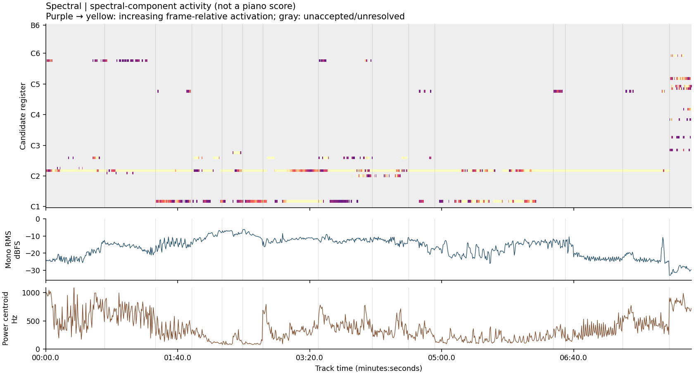

### 04. I'm Transmitting Tonight — 05:16.7

**Defining structure: Bb major family alternating with Ab major family.** The clearest reduction alternates Bb2–F3–A3–D4–F4 material with Ab2–Eb3–C4–Eb4 material. The first group supports a Bb-major-seventh interpretation when A3 is simultaneous; without A it is a Bb-major voicing. The second supports Ab major. D4 and C4 can overlap through decay, so the section-wide union must not be played as one block chord. Strong Bb-family windows begin near 00:00, 02:03 and 03:09.5; Ab-family windows occur near 01:38, 02:37, 03:27 and 04:24. These are analysis windows, not exact attack times.

**Reconstruction:** Use P1 with two separately recorded source voicings: Bb2/F3/A3/D4/F4 and Ab2/Eb3/C4/Eb4. Schedule attacks from the pitch-activity data rather than adding a kick or an assumed 4/4 grid. Preserve C4 around 263.1 Hz and D4 around 295.3 Hz in the exposed layer when targeting the stream; exact equal temperament would remove some of the measured offset. Keep a distorted low branch and a clearer upper transient branch. Patch P1 is a proposed source/process initialization; per-track original instrument identity remains unknown unless independently cited above.

| Window / time | Supported pitch components: Hz (cents) | Key-profile fit, not confirmed key | Representative 0.5-s candidate snapshot |
| --- | --- | --- | --- |
| 01 · 00:00.0–00:15.0 | Bb2: 118.74 (+32.4); Eb3: 156.19 (+7.0); F3: 174.98 (+3.6); A3: 219.92 (-0.6); D4: 295.31 (+9.7); F4: 352.23 (+14.8); G4: 394.45 (+10.8) | D minor (r=0.90) | 00:10.5: D4, Bb2, F3, F4, A3 |
| 02 · 00:15.0–01:05.5 | Bb2: 118.80 (+33.3); Eb3: 156.17 (+6.8); F3: 174.77 (+1.6); A3: 217.94 (-16.3); C4: 263.17 (+10.2); D4: 295.43 (+10.4); F4: 351.56 (+11.5) | Bb major (r=0.80) | 00:47.0: D4, C4, Bb2, F3, F4, A3 |
| 03 · 01:05.5–01:38.0 | Bb2: 117.24 (+10.4); F3: 174.08 (-5.3); A3: 218.01 (-15.7); D4: 294.78 (+6.6); F4: 350.70 (+7.3) | D minor (r=0.94) | 01:10.5: D4, F3, Bb2, F4, A3 |
| 04 · 01:38.0–02:03.0 | Ab2: 104.09 (+4.3); Eb3: 155.34 (-2.5); F3: 174.44 (-1.7); C4: 263.04 (+9.3); D4: 295.36 (+10.0); Eb4: 313.23 (+11.7) | C minor (r=0.91) | 01:58.5: C4, Ab2, Eb3, Eb4 |
| 05 · 02:03.0–02:37.0 | Bb2: 116.79 (+3.6); F3: 175.34 (+7.2); A3: 219.19 (-6.4); D4: 295.26 (+9.4); F4: 351.98 (+13.6); A4: 442.68 (+10.5) | D minor (r=0.95) | 02:07.5: D4, F3, Bb2, F4, A3 |
| 06 · 02:37.0–03:09.5 | F#2: 94.91 (+44.5); Ab2: 105.53 (+28.2); C#3: 136.26 (-29.4); Eb3: 153.88 (-18.9); Bb3: 234.42 (+9.9); C4: 263.22 (+10.5); C#4: 278.48 (+8.1); Eb4: 313.52 (+13.2) | Ab major (r=0.75) | 02:55.5: C4, Ab2, Eb3, Eb4, C#3 |
| 07 · 03:09.5–03:27.0 | Bb2: 118.09 (+22.8); F3: 174.70 (+0.8); A3: 218.50 (-11.9); D4: 295.40 (+10.2); F4: 351.52 (+11.3) | D minor (r=0.92) | 03:25.5: D4, Bb2, F3, F4, A3 |
| 08 · 03:27.0–03:49.0 | Ab2: 102.77 (-17.8); Eb3: 155.51 (-0.6); F3: 174.37 (-2.4); C4: 263.14 (+10.0); D4: 295.36 (+10.0); Eb4: 312.95 (+10.1) | C minor (r=0.89) | 03:46.5: C4, Ab2, Eb3, Eb4 |
| 09 · 03:49.0–04:24.0 | Ab2: 102.62 (-20.2); Bb2: 117.41 (+12.9); Eb3: 157.04 (+16.4); F3: 173.38 (-12.2); C4: 263.21 (+10.5); D4: 295.48 (+10.7); Eb4: 312.80 (+9.3); F4: 352.20 (+14.7) | Bb major (r=0.78) | 04:00.5: D4, Ab2, C4, F4, Eb4, Eb3 |
| 10 · 04:24.0–04:46.0 | Ab2: 102.65 (-19.8); Bb2: 117.40 (+12.7); Eb3: 157.08 (+16.8); F3: 173.39 (-12.2); C4: 263.18 (+10.3); D4: 295.22 (+9.1) | Ab major (r=0.86) | 04:37.5: Ab2, C4, Eb3, Bb2, F3 |
| 11 · 04:46.0–05:16.7 | G1: 50.04 (+36.3) | Withheld: insufficient supported components | 05:04.0: G1 |

**Measured dynamics and texture.** Use these as section targets; retain the full envelopes for within-section motion.

| Window | RMS dBFS | Power centroid Hz | Side/mid dB | Flatness | Envelope period s (r) |
| --- | --- | --- | --- | --- | --- |
| 1 | -14.49 | 435.7 | -6.7 | 0.0003 | 1.96 (0.10) |
| 2 | -13.71 | 403.1 | -5.83 | 0.0001 | 0.24 (0.10) |
| 3 | -12.91 | 408.6 | -7.14 | 0.0 | 0.86 (0.07) |
| 4 | -13.81 | 361.6 | -8.25 | 0.0 | 0.54 (0.08) |
| 5 | -13.9 | 427.3 | -5.6 | 0.0001 | 0.12 (0.16) |
| 6 | -12.59 | 350.6 | -8.35 | 0.0001 | 0.24 (0.14) |
| 7 | -12.69 | 415.4 | -6.66 | 0.0001 | 0.20 (0.14) |
| 8 | -12.47 | 354.0 | -7.48 | 0.0001 | 0.18 (0.09) |
| 9 | -16.77 | 292.0 | -5.85 | 0.0 | 0.18 (0.20) |
| 10 | -22.27 | 223.0 | -5.53 | 0.0004 | 3.24 (0.09) |
| 11 | -34.63 | 863.5 | -11.15 | 0.003 | 3.06 (0.07) |

The snapshot selects the densest supported candidate frame, not a typical or definitive chord. The pitch plot below is gated by the spectral-component mask; blank regions mean unresolved pitch evidence, not necessarily silence.

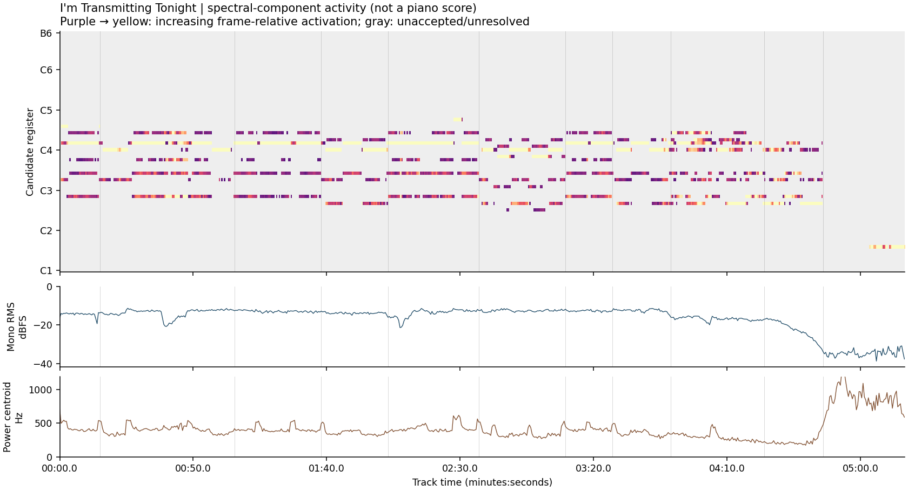

### 05. 7000 Miles — 05:43.8

**Defining structure: Eb Bb and F as the structural pitch poles.** Much of the track emphasizes Eb1, F1 and Bb1, with F3/Bb3 and occasional higher Eb components. These are fourth/fifth relations with considerable low-frequency interaction; the evidence is insufficient to impose a normal Eb-major/Bb-major functional progression. Between about 00:59.5 and 03:52.5, F/Bb material becomes especially prominent. Eb regains weight in the following long span. The final 23 seconds introduce E5/D5/A4/A5 material and need a separate rendering state.

**Reconstruction:** Use P2 with independently controlled Eb, F and Bb resonators. Do not put the entire low cluster through the same full-band limiter: separate 35–75 Hz from the F3/Bb3 body. Derive the choir-like band from the upper resonators with a broad formant emphasis, not a new unrelated choir melody. Switch to a brighter P1-like upper fragment for the measured ending state. Patch P2 is a proposed source/process initialization; per-track original instrument identity remains unknown unless independently cited above.

| Window / time | Supported pitch components: Hz (cents) | Key-profile fit, not confirmed key | Representative 0.5-s candidate snapshot |
| --- | --- | --- | --- |
| 01 · 00:00.0–00:59.5 | Eb1: 38.89 (-0.0); G1: 49.98 (+34.2); F4: 353.72 (+22.1) | Eb major (r=0.76) | 00:48.5: Eb1, G1, F4 |
| 02 · 00:59.5–01:18.5 | F1: 43.13 (-21.1); G1: 50.00 (+34.9); Bb1: 58.03 (-7.0); C3: 131.34 (+7.0); Bb3: 235.79 (+20.0) | F major (r=0.80) | 01:03.0: Bb1, G1, Bb3 |
| 03 · 01:18.5–01:40.5 | Eb1: 38.98 (+4.1); F1: 43.15 (-20.3); Bb1: 58.16 (-3.2); C3: 131.35 (+7.1); F3: 173.79 (-8.2); Bb3: 235.56 (+18.3); Bb5: 936.70 (+8.1) | Bb major (r=0.73) | 01:29.5: Eb1, Bb1, Bb3, F3 |
| 04 · 01:40.5–02:14.0 | Eb1: 39.10 (+9.1); F1: 43.28 (-14.8); Bb1: 58.03 (-7.0); C3: 131.31 (+6.5); Eb3: 157.56 (+22.0); F3: 177.35 (+26.9); Bb3: 235.62 (+18.8); Eb6: 1254.26 (+13.5) | Bb major (r=0.80) | 01:46.5: F1, Bb1, Eb1, F3, Bb3 |
| 05 · 02:14.0–02:57.5 | F1: 43.13 (-21.1); Bb1: 58.12 (-4.4); Bb2: 118.05 (+22.3); C3: 131.46 (+8.5); F3: 177.31 (+26.5); Bb3: 235.71 (+19.4) | Bb major (r=0.83) | 02:29.0: Bb3, F3, Bb1, Bb2 |
| 06 · 02:57.5–03:52.5 | Eb1: 38.97 (+3.3); Bb1: 58.14 (-4.0); Bb2: 117.91 (+20.3); F3: 177.35 (+26.9); Bb3: 235.87 (+20.6); C5: 527.48 (+13.9); Eb6: 1235.93 (-12.0) | Bb major (r=0.84) | 03:33.5: Bb1, F3, Eb6, Bb2, C5, Bb3 |
| 07 · 03:52.5–05:20.5 | Eb1: 38.96 (+3.1); F1: 43.58 (-3.1); Bb1: 57.93 (-10.2); Eb2: 76.60 (-26.4); Bb2: 116.30 (-3.6); Eb3: 158.02 (+27.1); Bb3: 235.76 (+19.8); Eb6: 1235.91 (-12.0) | Eb major (r=0.82) | 04:49.5: Eb1, F1, Bb1, Eb2, Bb2, Eb6, Eb3, Bb3 |
| 08 · 05:20.5–05:43.8 | E4: 328.94 (-3.6); A4: 445.65 (+22.1); Bb4: 473.14 (+25.7); D5: 589.43 (+6.2); E5: 658.10 (-3.0); A5: 877.51 (-4.9); B5: 987.16 (-1.1); C6: 1021.75 (-41.4) | A major (r=0.79) | 05:34.0: E5, A4, B5, Bb4, C6 |

**Measured dynamics and texture.** Use these as section targets; retain the full envelopes for within-section motion.

| Window | RMS dBFS | Power centroid Hz | Side/mid dB | Flatness | Envelope period s (r) |
| --- | --- | --- | --- | --- | --- |
| 1 | -22.6 | 535.9 | -4.14 | 0.0034 | 0.24 (0.28) |
| 2 | -19.31 | 674.0 | -3.28 | 0.0051 | 0.50 (0.36) |
| 3 | -20.4 | 699.4 | -1.86 | 0.0075 | 0.14 (0.14) |
| 4 | -20.01 | 801.2 | -0.74 | 0.0137 | 0.50 (0.32) |
| 5 | -19.86 | 795.1 | -0.79 | 0.0159 | 0.50 (0.28) |
| 6 | -18.97 | 1003.2 | -0.92 | 0.0164 | 0.50 (0.31) |
| 7 | -23.88 | 947.6 | -1.0 | 0.0172 | 0.50 (0.25) |
| 8 | -40.75 | 959.8 | -6.42 | 0.0122 | 0.14 (0.38) |

The snapshot selects the densest supported candidate frame, not a typical or definitive chord. The pitch plot below is gated by the spectral-component mask; blank regions mean unresolved pitch evidence, not necessarily silence.

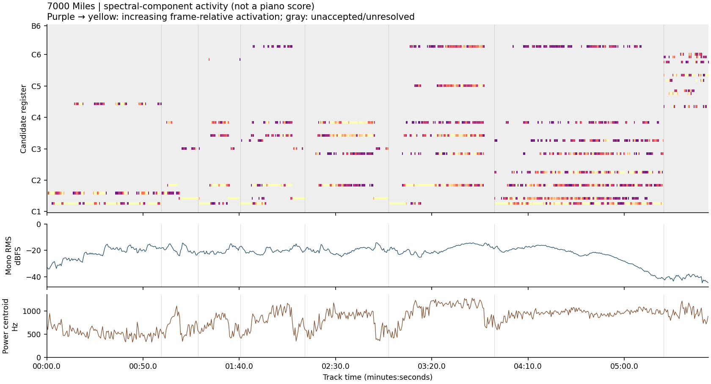

### 06. Shipyard Of La Ceiba — 01:56.1

**Defining structure: Bb F followed by a G D Eb field.** The first 62 seconds emphasize Bb3 and F3, with Bb2 early and a Gb/F# component appearing in the lower register. The latter part instead emphasizes D3 and Eb3 over G/Ab-related low content. The D/Eb semitone is a concrete tension to preserve. A blanket Bb-minor key for the entire miniature would miss the change at about 01:02 and would overstate evidence for a stable minor third in the first half.

**Reconstruction:** Start with a Bb3/F3 sustained dyad and a quieter Bb2 body using P4. At the measured transition, move the upper body toward D3/Eb3 and leave the low layer as a separately filtered object. Preserve the close D/Eb interval even if its roughness tempts a conventional mix cleanup. There is no need to invent a melodic fill at the join. Patch P4 is a proposed source/process initialization; per-track original instrument identity remains unknown unless independently cited above.

| Window / time | Supported pitch components: Hz (cents) | Key-profile fit, not confirmed key | Representative 0.5-s candidate snapshot |
| --- | --- | --- | --- |
| 01 · 00:00.0–00:34.0 | F#2: 93.49 (+18.5); Bb2: 116.43 (-1.6); F3: 173.96 (-6.5); Bb3: 233.35 (+2.0) | Bb minor (r=0.84) | 00:02.5: Bb3, F3, Bb2 |
| 02 · 00:34.0–01:02.0 | F#2: 92.69 (+3.6); F3: 173.95 (-6.6); Bb3: 232.99 (-0.6); F4: 348.90 (-1.6) | Bb minor (r=0.87) | 00:46.5: Bb3, F3, F#2 |
| 03 · 01:02.0–01:56.1 | G1: 49.57 (+20.1); Ab1: 50.64 (-42.9); D3: 148.45 (+18.9); Eb3: 152.36 (-36.0); F3: 174.02 (-5.9); Bb3: 232.93 (-1.1) | G minor (r=0.61) | 01:21.0: D3, G1, Eb3, Ab1, F3, Bb3 |

**Measured dynamics and texture.** Use these as section targets; retain the full envelopes for within-section motion.

| Window | RMS dBFS | Power centroid Hz | Side/mid dB | Flatness | Envelope period s (r) |
| --- | --- | --- | --- | --- | --- |
| 1 | -20.94 | 242.3 | -2.2 | 0.0026 | 3.24 (0.27) |
| 2 | -22.25 | 222.8 | -3.72 | 0.0008 | 3.92 (0.22) |
| 3 | -17.24 | 161.9 | -4.49 | 0.0004 | 3.30 (0.12) |

The snapshot selects the densest supported candidate frame, not a typical or definitive chord. The pitch plot below is gated by the spectral-component mask; blank regions mean unresolved pitch evidence, not necessarily silence.

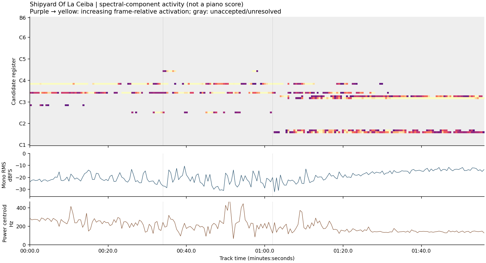

### 07. Careless Whispers — 05:11.3

**Defining structure: Semitone tension gives way to changing upper dyads.** D3 and Eb3 dominate the first roughly 109 seconds, with low G/Ab content. The middle introduces Bb3/Db4, then G3/Bb3/Eb3; the latter is an Eb-major pitch group, although its continuity and inversion must be taken from the frame data. After 04:13.5 the strongest automatically proposed low notes fail the independent narrow-peak check. Those last windows should be represented as unresolved texture rather than confident Db-major harmony.

**Reconstruction:** Use P4 for the opening D3/Eb3 pair and keep it separate from the low rumble. Change to an upper Bb3/Db4 pair, then the measured Eb3/G3/Bb3 set, with overlapping tails. Use P5 for the end instead of writing MIDI from the rejected low-frequency key estimate. This track is a useful example of why unfiltered key labels would damage a machine reconstruction. Patch P4 is a proposed source/process initialization; per-track original instrument identity remains unknown unless independently cited above.

| Window / time | Supported pitch components: Hz (cents) | Key-profile fit, not confirmed key | Representative 0.5-s candidate snapshot |
| --- | --- | --- | --- |
| 01 · 00:00.0–01:30.0 | G1: 49.57 (+19.9); Ab1: 50.64 (-43.1); D3: 148.46 (+19.0); Eb3: 152.36 (-36.1) | D minor (r=0.47) | 00:08.0: D3, Eb3, G1, Ab1 |
| 02 · 01:30.0–01:49.5 | C#2: 71.16 (+46.0); D2: 72.93 (-11.4); Eb2: 76.63 (-25.8); D3: 148.38 (+18.1); Eb3: 152.33 (-36.3); Bb3: 231.80 (-9.5) | D minor (r=0.53) | 01:33.5: D3, D2, Eb3, Eb2 |
| 03 · 01:49.5–02:27.0 | Bb3: 231.83 (-9.3); C#4: 276.90 (-1.8) | Bb minor (r=0.81) | 02:14.0: Bb3, C#4 |
| 04 · 02:27.0–03:03.0 | Eb3: 154.78 (-8.7); G3: 195.14 (-7.6); Bb3: 232.01 (-8.0) | G minor (r=0.79) | 02:48.5: G3, Bb3, Eb3 |
| 05 · 03:03.0–03:20.0 | D1: 37.05 (+15.9); Eb1: 38.93 (+1.8); F#1: 46.50 (+9.2); A1: 54.49 (-16.0); B1: 62.23 (+13.7); Eb2: 77.87 (+1.9); C3: 132.42 (+21.1); Eb3: 157.47 (+21.1) | Eb minor (r=0.62) | 03:08.5: F#1, C3, Eb2, Eb1, B1 |
| 06 · 03:20.0–03:53.0 | Bb3: 231.63 (-10.8) | Withheld: insufficient supported components | 03:20.0: Bb3 |
| 07 · 03:53.0–04:13.5 | G3: 195.82 (-1.6); Bb3: 233.36 (+2.0); C#4: 279.48 (+14.3) | Bb major (r=0.73) | 03:56.5: Bb3, G3, C#4 |
| 08 · 04:13.5–04:40.0 | No candidate passes the narrow-peak gate | Withheld: insufficient supported components | 04:13.5: none |
| 09 · 04:40.0–05:11.3 | No candidate passes the narrow-peak gate | Withheld: insufficient supported components | 04:40.0: none |

**Measured dynamics and texture.** Use these as section targets; retain the full envelopes for within-section motion.

| Window | RMS dBFS | Power centroid Hz | Side/mid dB | Flatness | Envelope period s (r) |
| --- | --- | --- | --- | --- | --- |
| 1 | -14.53 | 150.6 | -3.23 | 0.0002 | 0.18 (0.09) |
| 2 | -15.58 | 149.1 | -2.7 | 0.001 | 3.20 (0.27) |
| 3 | -17.11 | 223.6 | -3.04 | 0.0016 | 3.20 (0.83) |
| 4 | -21.03 | 136.0 | -3.58 | 0.0008 | 0.18 (0.34) |
| 5 | -18.1 | 133.6 | -5.72 | 0.0004 | 0.64 (0.41) |
| 6 | -22.71 | 95.0 | -5.01 | 0.0007 | 0.12 (0.42) |
| 7 | -22.76 | 120.9 | -6.22 | 0.0004 | 0.12 (0.53) |
| 8 | -23.58 | 65.4 | -4.55 | 0.0009 | 0.16 (0.24) |
| 9 | -20.85 | 50.5 | -5.51 | 0.0021 | 0.10 (0.15) |

The snapshot selects the densest supported candidate frame, not a typical or definitive chord. The pitch plot below is gated by the spectral-component mask; blank regions mean unresolved pitch evidence, not necessarily silence.

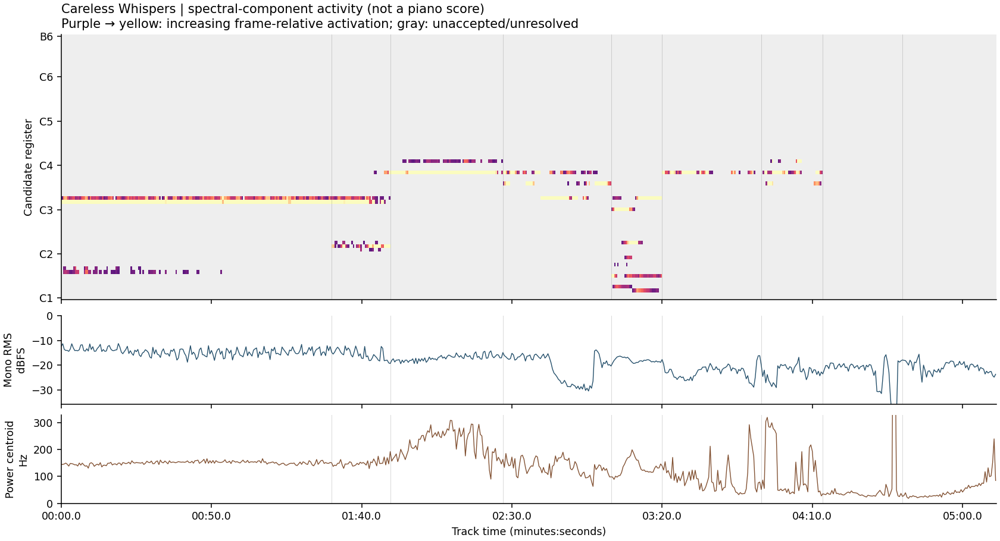

### 08. The Star Compass — 04:49.3

**Defining structure: Db and Gb fields with a local F minor region.** The clearest upper components are Db5, Gb4/Gb5, F5 and Bb4. Their relative weight supports a Db/Gb major-family reading, but not one immutable tonic. Around 02:41–02:59, F3/F4–Ab4–C5 forms a more explicit F-minor group. The final span emphasizes F3–Db4–Ab4, compatible with Db/F as a reduction. Enharmonic spellings in the raw data use C# and F#; the flats here express the musical relationships more clearly.

**Reconstruction:** Use P1 with a lightly struck, high-register source rather than an undifferentiated pad. Render the Db/Gb region, F-minor region, and Db/F-like region as separate source states. Keep the measured register gap between F3 and the upper fourth/fifth octave voices. Spectral residue below about 50 Hz in the opening is not sufficient reason to add an extra tuned sub oscillator. Patch P1 is a proposed source/process initialization; per-track original instrument identity remains unknown unless independently cited above.

| Window / time | Supported pitch components: Hz (cents) | Key-profile fit, not confirmed key | Representative 0.5-s candidate snapshot |
| --- | --- | --- | --- |
| 01 · 00:00.0–00:36.0 | C#5: 549.31 (-15.9) | Withheld: insufficient supported components | 00:18.0: C#5 |
| 02 · 00:36.0–01:19.0 | Eb4: 309.31 (-10.1); F#4: 366.71 (-15.4); Ab4: 411.45 (-16.2); Bb4: 462.68 (-13.0); C#5: 548.99 (-16.9); F5: 699.99 (+3.8) | C# major (r=0.88) | 00:36.5: C#5, F#4, F5, Bb4, Ab4, Eb4 |
| 03 · 01:19.0–01:40.5 | C#4: 274.78 (-15.1); F#4: 366.56 (-16.1); C#5: 549.42 (-15.5); F#5: 733.50 (-15.3); Bb5: 924.06 (-15.4) | Bb minor (r=0.84) | 01:22.5: F#5, Bb5, F#4, C#5 |
| 04 · 01:40.5–01:58.5 | Bb3: 231.47 (-12.0); C#4: 274.70 (-15.6); Bb4: 463.31 (-10.6); C#5: 549.31 (-15.8); F5: 692.76 (-14.2) | C# major (r=0.77) | 01:53.5: C#5, F5, C#4, Bb3, Bb4 |
| 05 · 01:58.5–02:14.5 | F#4: 366.77 (-15.2); Bb4: 462.65 (-13.1); C#5: 549.52 (-15.2); F#5: 733.45 (-15.4) | F# major (r=0.87) | 02:08.5: F#4, C#5, Bb4 |
| 06 · 02:14.5–02:41.0 | F#4: 366.85 (-14.8); Ab4: 411.62 (-15.4); Bb4: 462.59 (-13.3); F#5: 733.19 (-16.0); Ab5: 823.16 (-15.6); Bb5: 923.15 (-17.1) | F# major (r=0.72) | 02:27.5: F#5, F#4, Bb4, Bb5 |
| 07 · 02:41.0–02:59.0 | F3: 172.10 (-25.2); F4: 346.20 (-15.1); Ab4: 411.65 (-15.3); C5: 519.44 (-12.6) | F minor (r=0.86) | 02:46.5: Ab4, C5, F4, F3 |
| 08 · 02:59.0–03:36.5 | C#4: 274.86 (-14.6); F#4: 366.76 (-15.2); Bb4: 462.53 (-13.5); C#5: 549.47 (-15.4) | F# major (r=0.86) | 03:16.5: F#4, C#4, C#5, Bb4 |
| 09 · 03:36.5–04:49.3 | F3: 175.34 (+7.2); C#4: 274.80 (-14.9); Ab4: 411.49 (-16.0); F#6: 1459.91 (-23.6) | Bb minor (r=0.81) | 04:19.0: F3, C#4, Ab4, F#6 |

**Measured dynamics and texture.** Use these as section targets; retain the full envelopes for within-section motion.

| Window | RMS dBFS | Power centroid Hz | Side/mid dB | Flatness | Envelope period s (r) |
| --- | --- | --- | --- | --- | --- |
| 1 | -23.24 | 477.5 | -7.95 | 0.0379 | 0.18 (0.14) |
| 2 | -21.09 | 979.1 | -8.54 | 0.073 | 1.50 (0.19) |
| 3 | -20.72 | 779.1 | -16.08 | 0.0413 | 3.26 (0.20) |
| 4 | -18.15 | 588.3 | -18.24 | 0.0272 | 0.10 (0.53) |
| 5 | -18.44 | 807.3 | -16.64 | 0.0405 | 3.68 (0.29) |
| 6 | -18.03 | 723.0 | -17.03 | 0.0356 | 0.22 (0.14) |
| 7 | -16.14 | 562.9 | -17.54 | 0.0284 | 0.16 (0.17) |
| 8 | -17.88 | 678.6 | -13.4 | 0.0361 | 0.12 (0.48) |
| 9 | -24.43 | 874.3 | -4.75 | 0.0494 | 0.16 (0.37) |

The snapshot selects the densest supported candidate frame, not a typical or definitive chord. The pitch plot below is gated by the spectral-component mask; blank regions mean unresolved pitch evidence, not necessarily silence.

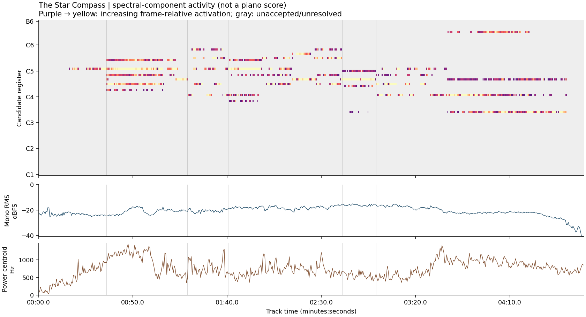

### 09. Azure Azure — 10:34.3

**Defining structure: Low C Eb Ab fields and paired semitone friction.** Until about 04:12.5 the low register repeatedly emphasizes C2/Eb2 with G2/Ab2 and several nearby components. In the long middle-to-late region, Eb4 and D4 coexist with G3 and Ab3. The D–Eb and G–Ab pairs are the distinctive harmonic friction; translating this into a plain C-minor triad would discard it. The final roughly 22 seconds change into a different low-frequency/noise state.

**Reconstruction:** Use P3 for the early low source and P4 for the paired G3/Ab3 and D4/Eb4 layer that becomes prominent after 04:12.5. Keep those four frequencies independently tunable and independently enveloped. Distort a parallel copy so that the semitone relationships remain audible in the cleaner body. Let the long span evolve through gain and masking; do not replace it with a generic rising chord progression. Patch P3 is a proposed source/process initialization; per-track original instrument identity remains unknown unless independently cited above.

| Window / time | Supported pitch components: Hz (cents) | Key-profile fit, not confirmed key | Representative 0.5-s candidate snapshot |
| --- | --- | --- | --- |
| 01 · 00:00.0–00:50.0 | C2: 65.38 (-0.6); C#2: 70.02 (+18.1); D2: 74.50 (+25.3); Eb2: 79.34 (+34.3); E2: 81.06 (-28.5); G2: 97.32 (-11.9); Ab2: 102.75 (-18.0) | Ab major (r=0.45) | 00:28.0: Eb2, G2, Ab2, D2, C2 |
| 02 · 00:50.0–01:17.5 | C2: 65.29 (-3.0); C#2: 69.96 (+16.6); Eb2: 79.37 (+35.0); E2: 83.98 (+32.6); G2: 98.03 (+0.6); Ab2: 101.26 (-43.4) | C minor (r=0.77) | 01:05.5: Eb2, E2, Ab2, C#2 |
| 03 · 01:17.5–01:45.5 | C2: 65.38 (-0.7); C#2: 70.02 (+18.1); Eb2: 79.35 (+34.5); E2: 83.98 (+32.8); G2: 98.06 (+1.0); Ab2: 102.70 (-18.9) | C minor (r=0.51) | 01:44.5: C#2, Eb2, E2, G2, Ab2 |
| 04 · 01:45.5–02:00.5 | C2: 65.35 (-1.5); C#2: 69.97 (+16.7); D2: 74.73 (+30.6); Eb2: 79.34 (+34.3); E2: 80.31 (-44.6); G2: 98.01 (+0.2); Ab2: 101.28 (-43.0) | C minor (r=0.79) | 01:53.0: C2, C#2, Ab2, G2, D2 |
| 05 · 02:00.5–02:19.0 | Eb1: 39.73 (+37.0); E1: 40.54 (-28.0); C2: 65.33 (-2.1); C#2: 67.62 (-42.3); D2: 74.77 (+31.7); Eb2: 79.41 (+35.9); E2: 80.41 (-42.5) | C minor (r=0.65) | 02:02.5: C2, Eb2, Eb1, C#2, E2, E1 |
| 06 · 02:19.0–03:03.5 | E1: 40.21 (-42.4); C#2: 67.46 (-46.5); D2: 75.20 (+41.5); Eb2: 79.57 (+39.4); G2: 100.43 (+42.4); Ab2: 101.18 (-44.7) | Eb major (r=0.56) | 02:49.5: G2, Ab2, Eb2, E1, C#2 |
| 07 · 03:03.5–03:21.0 | E1: 40.21 (-42.4); C2: 67.12 (+44.9); C#2: 67.49 (-45.7); Eb2: 79.86 (+45.6); E2: 80.26 (-45.7); G2: 100.10 (+36.7); Ab2: 101.21 (-44.1) | Ab major (r=0.63) | 03:11.5: Ab2, G2, C2, C#2, E2 |
| 08 · 03:21.0–04:12.5 | E1: 40.21 (-42.4); C2: 65.35 (-1.4); C#2: 70.00 (+17.5); Eb2: 79.41 (+35.8); E2: 80.97 (-30.4); G2: 98.01 (+0.2); Ab2: 101.11 (-46.0) | C minor (r=0.58) | 04:02.5: Eb2, C2, C#2, E2, Ab2, G2, E1 |
| 09 · 04:12.5–05:42.5 | B1: 60.06 (-47.7); Eb3: 152.01 (-40.0); G3: 199.81 (+33.4); Ab3: 202.71 (-41.7); D4: 296.31 (+15.5); Eb4: 303.01 (-45.8) | Eb major (r=0.66) | 05:35.0: Eb4, D4, G3, Ab3, B1, Eb3 |
| 10 · 05:42.5–07:12.5 | Bb1: 59.38 (+32.8); B1: 60.06 (-47.7); Eb3: 151.97 (-40.5); G3: 199.81 (+33.4); Ab3: 203.15 (-38.0); D4: 296.30 (+15.5); Eb4: 303.01 (-45.8) | Eb major (r=0.67) | 06:22.5: Eb4, D4, G3, B1, Ab3, Bb1, Eb3 |
| 11 · 07:12.5–08:42.5 | Eb3: 152.05 (-39.5); G3: 199.57 (+31.3); Ab3: 203.24 (-37.2); D4: 293.91 (+1.5); Eb4: 305.71 (-30.4) | Eb major (r=0.67) | 07:15.0: Eb4, D4, Ab3, G3, Eb3 |
| 12 · 08:42.5–10:12.5 | C2: 66.69 (+33.7); C#2: 67.46 (-46.5); Ab2: 101.35 (-41.8); G3: 200.28 (+37.4); Ab3: 203.15 (-38.0); D4: 293.92 (+1.5); Eb4: 305.71 (-30.4) | C minor (r=0.73) | 09:41.5: Eb4, D4, C2, Ab2, C#2, Ab3, G3 |
| 13 · 10:12.5–10:34.3 | C#1: 35.15 (+24.7); D1: 37.51 (+37.6); Eb1: 37.85 (-46.9); E1: 40.53 (-28.5) | C# minor (r=0.71) | 10:34.0: C#1, E1 |

**Measured dynamics and texture.** Use these as section targets; retain the full envelopes for within-section motion.

| Window | RMS dBFS | Power centroid Hz | Side/mid dB | Flatness | Envelope period s (r) |
| --- | --- | --- | --- | --- | --- |
| 1 | -21.07 | 327.9 | -3.41 | 0.0038 | 0.20 (0.17) |
| 2 | -14.46 | 727.9 | -4.18 | 0.0008 | 0.22 (0.38) |
| 3 | -15.07 | 892.5 | -3.83 | 0.0011 | 0.44 (0.26) |
| 4 | -12.8 | 817.6 | -5.16 | 0.0018 | 0.22 (0.14) |
| 5 | -14.17 | 748.5 | -5.23 | 0.0021 | 0.16 (0.10) |
| 6 | -15.95 | 953.6 | -2.65 | 0.0022 | 0.22 (0.28) |
| 7 | -14.68 | 752.8 | -3.45 | 0.0017 | 0.22 (0.39) |
| 8 | -13.69 | 358.3 | -6.66 | 0.0008 | 2.96 (0.17) |
| 9 | -16.52 | 436.8 | -6.52 | 0.0001 | 2.96 (0.21) |
| 10 | -13.77 | 352.4 | -10.83 | 0.0 | 3.32 (0.22) |
| 11 | -13.89 | 356.3 | -10.54 | 0.0001 | 0.74 (0.16) |
| 12 | -13.36 | 433.2 | -8.87 | 0.0004 | 2.96 (0.28) |
| 13 | -32.34 | 452.9 | -5.5 | 0.0103 | 3.92 (0.10) |

The snapshot selects the densest supported candidate frame, not a typical or definitive chord. The pitch plot below is gated by the spectral-component mask; blank regions mean unresolved pitch evidence, not necessarily silence.

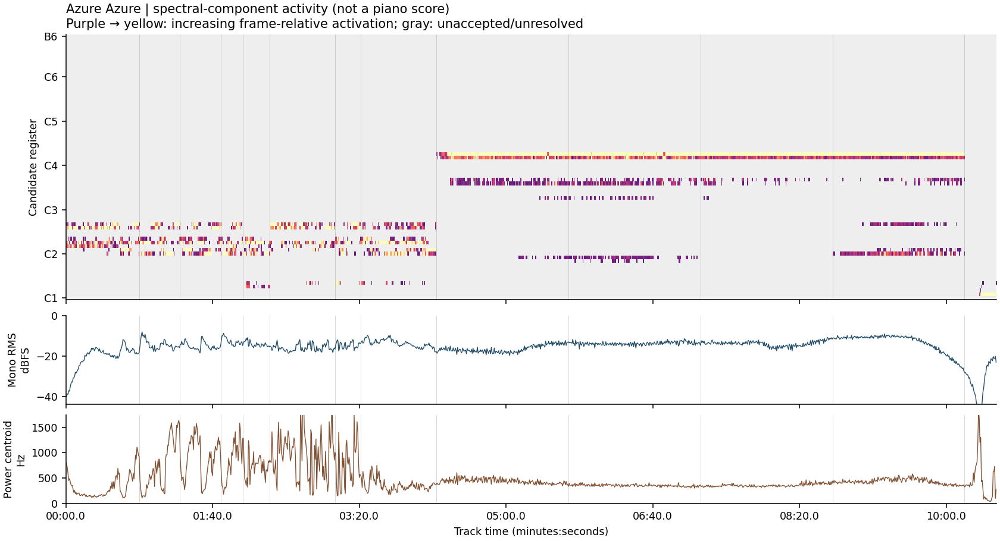

### 10. Trade Winds, White Heat — 04:24.3

**Defining structure: Eb minor and B major share an exposed inner dyad.** Eb3 and Gb3/F#3 remain unusually clear. Adding Bb3/Db4 supports an Eb-minor-seventh field; adding B2/B3 instead makes B-major-family voicings possible because Eb is enharmonic D#. This is common-tone reinterpretation, not simply an arbitrary switch between unrelated pads. B-related weight rises around 02:29.5 and 03:08.5. The closing 32 seconds emphasize F#4/B3, while some high components are detuned enough to resist a simple keyboard label.

**Reconstruction:** Use P4 or a soft P1 source centered on Eb3/Gb3. Keep these notes through the change from Eb3/Gb3/Bb3/Db4 toward B2/Eb3/Gb3/B3. Reduce noisy branches rather than introducing a wholly different instrument to achieve clarity. Use measured frequencies near 155.4 and 184.8 Hz for the stable inner dyad; their near-tempered tuning contrasts with more unstable low residue. Patch P4 is a proposed source/process initialization; per-track original instrument identity remains unknown unless independently cited above.

| Window / time | Supported pitch components: Hz (cents) | Key-profile fit, not confirmed key | Representative 0.5-s candidate snapshot |
| --- | --- | --- | --- |
| 01 · 00:00.0–00:13.0 | C#1: 35.15 (+24.9); D1: 37.51 (+37.6); Eb1: 37.85 (-46.9); E1: 40.54 (-28.2); Eb3: 155.29 (-3.0); F#3: 184.59 (-3.8) | C# minor (r=0.62) | 00:09.5: C#1, Eb3, E1, Eb1, D1, F#3 |
| 02 · 00:13.0–00:38.5 | Eb3: 155.34 (-2.5); F#3: 184.70 (-2.8) | F# major (r=0.75) | 00:13.5: F#3, Eb3 |
| 03 · 00:38.5–01:56.0 | Eb3: 155.44 (-1.3); F#3: 184.80 (-1.8); Bb3: 233.09 (+0.0); B3: 246.95 (+0.1); C#4: 277.04 (-0.9); Eb4: 311.13 (+0.0); F4: 349.02 (-1.0); F#4: 370.09 (+0.4) | Eb minor (r=0.92) | 01:30.5: F#3, Eb3, Bb3, F#4, Eb4 |
| 04 · 01:56.0–02:29.5 | Ab2: 103.83 (+0.0); Eb3: 155.51 (-0.6); F#3: 184.91 (-0.8); Bb3: 233.08 (+0.0); B3: 246.91 (-0.2); C#4: 277.07 (-0.7); Eb4: 311.12 (-0.0); F#4: 370.03 (+0.1) | Eb minor (r=0.92) | 02:08.5: F#3, Eb3, C#4, F#4, Eb4 |
| 05 · 02:29.5–02:51.0 | Ab2: 103.95 (+2.1); B2: 123.43 (-0.5); Eb3: 155.43 (-1.4); F#3: 184.81 (-1.8); Ab3: 207.59 (-0.5); B3: 246.96 (+0.1); C#4: 277.03 (-1.0); F#4: 370.23 (+1.1) | B major (r=0.88) | 02:42.5: F#3, B2, Eb3, C#4, Ab2, F#4 |
| 06 · 02:51.0–03:08.5 | B2: 123.26 (-3.0); Eb3: 155.37 (-2.2); F#3: 184.77 (-2.1); Ab3: 207.34 (-2.6); B3: 246.73 (-1.5) | Eb minor (r=0.86) | 03:08.0: F#3, Ab3, B2, B3 |
| 07 · 03:08.5–03:25.0 | B2: 123.30 (-2.4); Eb3: 155.45 (-1.3); F#3: 184.94 (-0.5); Ab3: 207.43 (-1.8); Bb3: 233.10 (+0.1); B3: 246.63 (-2.2); Eb4: 311.13 (+0.0) | B major (r=0.81) | 03:10.5: B2, Eb3, Eb4, B3, F#3 |
| 08 · 03:25.0–03:52.0 | Eb3: 155.48 (-0.9); F#3: 184.76 (-2.2); B3: 246.89 (-0.4) | Eb minor (r=0.76) | 03:34.0: F#3, Eb3, B3 |
| 09 · 03:52.0–04:24.3 | B2: 120.62 (-40.4); B3: 246.50 (-3.1); F#4: 369.63 (-1.7); A5: 862.69 (-34.4) | B major (r=0.79) | 04:16.0: F#4, B3, B2, A5 |

**Measured dynamics and texture.** Use these as section targets; retain the full envelopes for within-section motion.

| Window | RMS dBFS | Power centroid Hz | Side/mid dB | Flatness | Envelope period s (r) |
| --- | --- | --- | --- | --- | --- |
| 1 | -24.38 | 80.8 | -3.88 | 0.0003 | 1.00 (0.14) |
| 2 | -21.22 | 215.6 | -4.6 | 0.0007 | 0.14 (0.47) |
| 3 | -13.02 | 285.0 | -5.6 | 0.0001 | 0.10 (0.72) |
| 4 | -15.96 | 267.1 | -3.64 | 0.0004 | 0.10 (0.69) |
| 5 | -15.14 | 271.5 | -5.38 | 0.0008 | 0.10 (0.70) |
| 6 | -12.39 | 243.9 | -4.23 | 0.0004 | 0.10 (0.65) |
| 7 | -15.48 | 257.9 | -2.12 | 0.0008 | 0.10 (0.64) |
| 8 | -19.67 | 290.2 | -3.49 | 0.0008 | 0.10 (0.35) |
| 9 | -34.64 | 835.4 | -1.64 | 0.0468 | 1.00 (0.18) |

The snapshot selects the densest supported candidate frame, not a typical or definitive chord. The pitch plot below is gated by the spectral-component mask; blank regions mean unresolved pitch evidence, not necessarily silence.

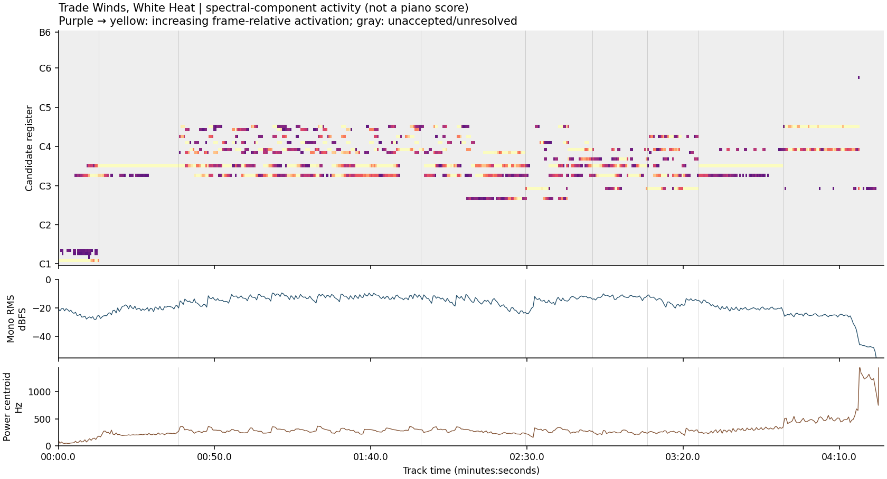

## Mirages: track-by-track measured reconstruction

### 01. Acephale — 04:57.9

**Defining structure: A related low field under strongly transformed material.** The initial and central windows contain strong A1-related activity and changing D2/E2 content, but the harmonic-template key flips between A major and minor. Independent peak support is uneven for the automatically selected neighboring low notes. Those flips should not be rendered as literal major/minor chord changes. The ending exposes E4/B4 and higher F# components more clearly. The measured result is a changing noisy field with local pitch anchors, not a trustworthy single-key piano score.

**Reconstruction:** Use P3, with a sparse low A/D/E source and a distinct E4/B4 ending object. Preserve per-section noise and register changes. The historical guitar-plus-sample origin is documented, but the source song and exact processing settings are not established. Do not fill every noisy frame with the algorithm’s top eight MIDI candidates; use only supported components as resonant targets and let the rest remain noise. Patch P3 is a proposed source/process initialization; per-track original instrument identity remains unknown unless independently cited above.

| Window / time | Supported pitch components: Hz (cents) | Key-profile fit, not confirmed key | Representative 0.5-s candidate snapshot |
| --- | --- | --- | --- |
| 01 · 00:00.0–00:27.5 | C3: 127.35 (-46.5); E3: 165.81 (+10.5); C6: 1034.67 (-19.7); C#6: 1101.56 (-11.2) | A minor (r=0.66) | 00:00.5: C3, E3, C6 |
| 02 · 00:27.5–01:35.5 | Ab1: 53.00 (+35.8); A1: 54.40 (-19.1); D2: 72.14 (-30.4); E2: 82.48 (+1.5); E6: 1309.31 (-12.1) | A major (r=0.82) | 01:20.5: A1, D2, Ab1, E6 |
| 03 · 01:35.5–02:11.0 | D2: 73.46 (+1.0); E5: 655.40 (-10.2) | A minor (r=0.79) | 01:41.5: D2, E5 |
| 04 · 02:11.0–02:48.0 | A2: 110.08 (+1.3); B2: 123.48 (+0.2); F#5: 739.47 (-1.2) | A minor (r=0.70) | 02:36.0: F#5, A2, B2 |
| 05 · 02:48.0–04:00.5 | Ab1: 53.02 (+36.4); A1: 55.82 (+25.6); Bb1: 57.28 (-29.8); D2: 72.01 (-33.4); E2: 83.64 (+25.6) | A major (r=0.79) | 03:39.5: A1, D2, Ab1, E2 |
| 06 · 04:00.5–04:17.0 | B1: 62.22 (+13.5); D2: 73.58 (+4.0); B2: 124.85 (+19.2); E3: 166.20 (+14.5); A3: 219.09 (-7.2); E4: 327.88 (-9.2) | A major (r=0.73) | 04:12.0: D2, B1, B2 |
| 07 · 04:17.0–04:36.0 | Bb1: 57.14 (-34.0); D2: 74.96 (+36.0); E4: 327.90 (-9.1) | D major (r=0.77) | 04:35.5: D2, E4 |
| 08 · 04:36.0–04:57.9 | C#1: 35.11 (+23.0); G1: 49.61 (+21.6); D2: 72.35 (-25.4); D4: 293.74 (+0.4); E4: 327.87 (-9.3); B4: 493.72 (-0.6); E6: 1316.56 (-2.6); F#6: 1484.76 (+5.6) | E minor (r=0.81) | 04:43.5: E4, E6, C#1, D4, G1 |

**Measured dynamics and texture.** Use these as section targets; retain the full envelopes for within-section motion.

| Window | RMS dBFS | Power centroid Hz | Side/mid dB | Flatness | Envelope period s (r) |
| --- | --- | --- | --- | --- | --- |
| 1 | -20.48 | 1343.0 | -7.74 | 0.0092 | 2.98 (0.03) |
| 2 | -12.66 | 1119.6 | -6.37 | 0.0124 | 0.18 (0.07) |
| 3 | -14.94 | 1157.2 | -3.13 | 0.0672 | 3.02 (0.07) |
| 4 | -14.62 | 1286.8 | -5.4 | 0.0325 | 0.48 (0.08) |
| 5 | -13.18 | 956.7 | -4.68 | 0.0177 | 0.40 (0.06) |
| 6 | -15.8 | 1053.0 | -1.93 | 0.0261 | 3.54 (0.13) |
| 7 | -16.02 | 1305.8 | -4.89 | 0.0212 | 2.30 (0.26) |
| 8 | -16.85 | 1366.9 | -6.59 | 0.0116 | 0.40 (0.21) |

The snapshot selects the densest supported candidate frame, not a typical or definitive chord. The pitch plot below is gated by the spectral-component mask; blank regions mean unresolved pitch evidence, not necessarily silence.

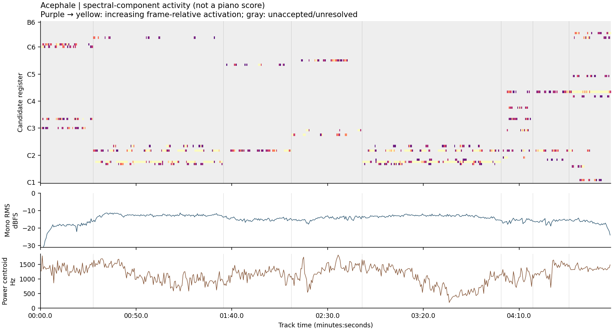

### 02. Neither More nor Less — 03:10.1

**Defining structure: F C upper field over shifting low foundations.** The opening spans contain low F2/C3/G2 and clear upper F5/C5/Bb4/A4/D5. F-major is a useful pitch-collection candidate, but the upper material must be voiced independently from the bass. After about 01:49, low C2/D2/G2/Ab2 becomes more prominent and the listening excerpt near the end contains spoken material. The upper F5/C5 components lie around 702.7/526.5 Hz, while the low F2 peak is near 86.8 Hz in the first window: they are not all tuned by one global offset.

**Reconstruction:** Use P2 for the body and a much clearer upper resonator pair near 702.7/526.5 Hz. Add Bb4 and A4 only where the event map supports them, not continuously as a five-note chord. Preserve the slight difference between upper and lower tuning. Move to a C/G-related low state after the measured transition; reserve a separate band-limited speech-like or noise layer for the end instead of inventing notes for it. Patch P2 is a proposed source/process initialization; per-track original instrument identity remains unknown unless independently cited above.

| Window / time | Supported pitch components: Hz (cents) | Key-profile fit, not confirmed key | Representative 0.5-s candidate snapshot |
| --- | --- | --- | --- |
| 01 · 00:00.0–01:11.5 | F2: 86.78 (-10.6); G2: 96.65 (-24.0); C3: 131.26 (+5.9); A4: 442.76 (+10.8); Bb4: 469.12 (+11.0); C5: 526.54 (+10.8); D5: 591.85 (+13.3); F5: 702.73 (+10.5) | F major (r=0.87) | 00:45.0: F2, F5, G2, C5, Bb4, A4, D5 |
| 02 · 01:11.5–01:28.0 | G1: 49.53 (+18.5); F2: 87.80 (+9.7); G2: 96.50 (-26.7); C3: 132.00 (+15.7); D3: 147.95 (+13.1); Bb4: 468.56 (+8.9); C5: 526.07 (+9.3); F5: 702.72 (+10.5) | F major (r=0.86) | 01:21.5: F2, C3, C5, G2, G1, Bb4, D3 |
| 03 · 01:28.0–01:49.0 | G1: 49.51 (+17.8); F2: 86.78 (-10.4); G2: 96.33 (-29.7); C3: 131.96 (+15.1); D3: 147.51 (+8.0); Bb4: 468.59 (+9.0); C5: 525.89 (+8.7); F5: 702.13 (+9.1) | C major (r=0.76) | 01:37.5: F2, G2, C3, C5, Bb4, D3 |
| 04 · 01:49.0–03:10.1 | F1: 43.47 (-7.4); G1: 49.94 (+33.0); C2: 65.72 (+8.3); D2: 73.46 (+1.1); F2: 86.39 (-18.3); G2: 97.22 (-13.9); Ab2: 104.51 (+11.3); C5: 526.01 (+9.1) | C major (r=0.77) | 02:16.5: C2, D2, G1, C5, F2, F1 |

**Measured dynamics and texture.** Use these as section targets; retain the full envelopes for within-section motion.

| Window | RMS dBFS | Power centroid Hz | Side/mid dB | Flatness | Envelope period s (r) |
| --- | --- | --- | --- | --- | --- |
| 1 | -15.47 | 401.8 | -2.83 | 0.0008 | 0.12 (0.21) |
| 2 | -17.31 | 330.0 | -0.32 | 0.0002 | 2.86 (0.15) |
| 3 | -17.3 | 277.8 | 0.39 | 0.0003 | 0.12 (0.29) |
| 4 | -15.44 | 194.7 | -2.73 | 0.0002 | 2.54 (0.12) |

The snapshot selects the densest supported candidate frame, not a typical or definitive chord. The pitch plot below is gated by the spectral-component mask; blank regions mean unresolved pitch evidence, not necessarily silence.

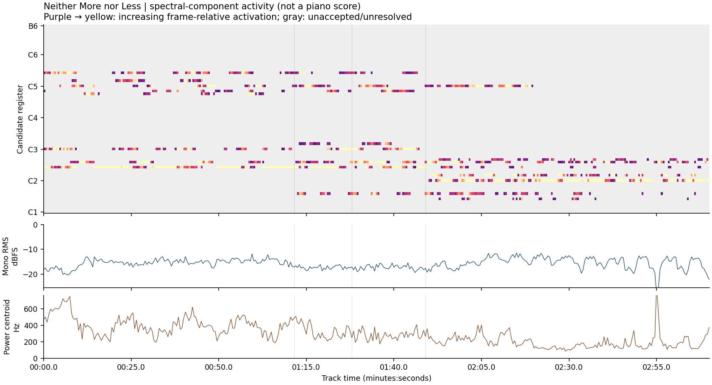

### 03. Aerial Silver — 03:38.0

**Defining structure: G Ab low beating field.** After the first 23 seconds, neighboring low G1 and Ab1 dominate much of the track, with B1/Db2 and other components changing around them. Several are narrow spectral components, but their adjacency and unstable balance make a functional Ab-major/minor reading misleading. The most useful reconstruction object is a low beating/resonant field. Distinguish the measured frequencies from the assumption that these were keyboard notes intentionally played together.

**Reconstruction:** Use P3 fed by P2 resonators tuned to the table’s actual G/Ab-region peaks. Keep the resonator bandwidth narrow enough to retain the beating relationship but put broadband grit on a parallel branch. Do not add full major or minor triads merely because the chroma model names them. Evolve the balance of the neighboring low components and the high friction layer across the listed sections. Patch P3 is a proposed source/process initialization; per-track original instrument identity remains unknown unless independently cited above.

| Window / time | Supported pitch components: Hz (cents) | Key-profile fit, not confirmed key | Representative 0.5-s candidate snapshot |
| --- | --- | --- | --- |
| 01 · 00:00.0–00:23.0 | Eb1: 39.60 (+31.3); C2: 65.73 (+8.5); C#2: 67.57 (-43.7); D2: 73.47 (+1.4); G2: 97.35 (-11.5) | C minor (r=0.71) | 00:09.0: C2, Eb1, C#2, G2 |
| 02 · 00:23.0–00:39.5 | G1: 49.96 (+33.7); Ab1: 50.66 (-42.4); Bb1: 59.72 (+42.6); B1: 60.16 (-44.8); C2: 67.12 (+44.9); C#2: 67.62 (-42.4) | Ab minor (r=0.65) | 00:38.5: Ab1, G1, B1, Bb1 |
| 03 · 00:39.5–00:58.0 | C#1: 34.64 (-0.6); G1: 50.30 (+45.4); Ab1: 50.64 (-43.1); Bb1: 59.72 (+42.6); B1: 60.23 (-42.7); A4: 442.98 (+11.7) | Ab minor (r=0.68) | 00:55.5: Ab1, G1, B1, A4, Bb1 |
| 04 · 00:58.0–01:30.0 | G1: 49.96 (+33.7); Ab1: 50.64 (-43.0); C#2: 67.70 (-40.4) | Ab major (r=0.59) | 01:20.0: Ab1, G1, C#2 |
| 05 · 01:30.0–01:59.0 | G1: 49.96 (+33.7); Ab1: 50.64 (-42.9); Bb1: 59.38 (+32.8); B1: 60.15 (-45.1) | Ab minor (r=0.64) | 01:37.0: Ab1, G1, B1, Bb1 |
| 06 · 01:59.0–02:37.0 | G1: 49.96 (+33.7); Ab1: 50.64 (-43.0); Bb1: 58.57 (+8.8); C2: 66.79 (+36.2); C#2: 67.63 (-42.2); F2: 88.41 (+21.8); Bb2: 117.36 (+12.1); D3: 147.69 (+10.1) | Ab major (r=0.49) | 02:30.0: Ab1, G1, D3, Bb2, F2 |
| 07 · 02:37.0–02:57.0 | G1: 49.91 (+31.8); Ab1: 50.64 (-43.1); B1: 60.29 (-41.1); C2: 66.79 (+36.2); C#2: 67.60 (-42.8) | C# major (r=0.58) | 02:50.0: C#2, C2, G1, Ab1 |
| 08 · 02:57.0–03:38.0 | G1: 49.96 (+33.7); Ab1: 51.78 (-4.3) | Ab major (r=0.65) | 03:31.0: Ab1, G1 |

**Measured dynamics and texture.** Use these as section targets; retain the full envelopes for within-section motion.

| Window | RMS dBFS | Power centroid Hz | Side/mid dB | Flatness | Envelope period s (r) |
| --- | --- | --- | --- | --- | --- |
| 1 | -17.26 | 515.8 | -8.99 | 0.0035 | 3.64 (0.10) |
| 2 | -15.85 | 358.2 | -8.83 | 0.004 | 1.96 (0.13) |
| 3 | -15.65 | 365.9 | -7.44 | 0.0034 | 0.44 (0.10) |
| 4 | -14.65 | 238.0 | -7.22 | 0.0018 | 3.92 (0.09) |
| 5 | -12.35 | 193.3 | -6.39 | 0.0017 | 0.14 (0.22) |
| 6 | -12.32 | 223.0 | -6.74 | 0.0015 | 1.98 (0.15) |
| 7 | -13.2 | 213.7 | -6.62 | 0.0031 | 0.12 (0.24) |
| 8 | -12.96 | 129.9 | -6.06 | 0.0027 | 1.66 (0.11) |

The snapshot selects the densest supported candidate frame, not a typical or definitive chord. The pitch plot below is gated by the spectral-component mask; blank regions mean unresolved pitch evidence, not necessarily silence.

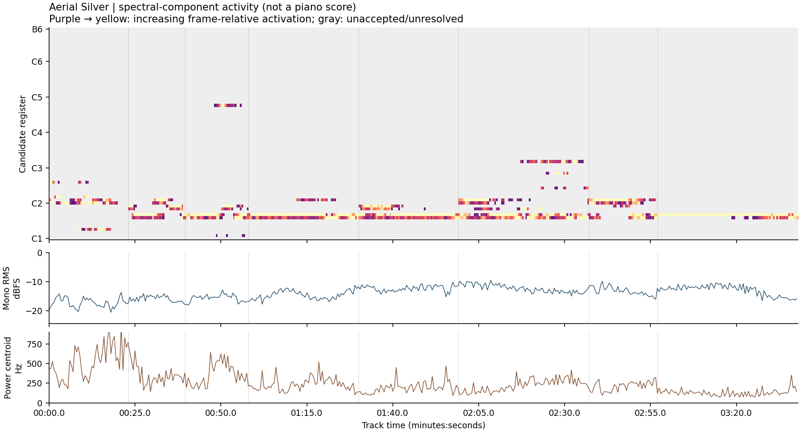

### 04. Celestina — 04:32.0

**Defining structure: G minor extensions moving toward D F and C.** The opening field combines G2, Bb2, D3, F3 and A4: a G-minor-nine reduction is musically plausible when these components coincide. From about 01:54, D3/F3 and upper A become more prominent, with F1 supporting some windows. From 03:18.5 the field shifts toward C3/C2/F-related components, and the last 38 seconds are dominated by C/F. These changes should be scheduled separately; a single G-minor pad does not reproduce the structure.

**Reconstruction:** Use P1 for the articulated upper material and P4 for G2/Bb2/D3/F3. Keep A4 as a separate upper extension, not a doubled bass harmonic. Change the bass/body toward F1/D3/F3 during the middle and C2/C3/F1 near the end. Retain note-event timing from the activity map rather than imposing the listening model’s unverified suggestion of driving percussion. Patch P1 is a proposed source/process initialization; per-track original instrument identity remains unknown unless independently cited above.

| Window / time | Supported pitch components: Hz (cents) | Key-profile fit, not confirmed key | Representative 0.5-s candidate snapshot |
| --- | --- | --- | --- |
| 01 · 00:00.0–01:30.0 | G1: 50.30 (+45.4); Ab1: 50.64 (-43.1); G2: 98.26 (+4.6); Bb2: 116.83 (+4.3); D3: 147.39 (+6.5); F3: 175.07 (+4.5); A4: 442.18 (+8.6); D5: 590.05 (+8.0) | G minor (r=0.73) | 00:17.5: G2, G1, Ab1, A4, F3, D5 |
| 02 · 01:30.0–01:33.5 | G1: 49.51 (+18.1); G2: 97.90 (-1.8); D3: 147.31 (+5.7); A4: 442.19 (+8.6) | G minor (r=0.69) | 01:31.0: G2, A4, G1 |
| 03 · 01:33.5–01:54.0 | F2: 87.60 (+5.8); G2: 98.22 (+3.8); Bb2: 116.89 (+5.2); D3: 147.40 (+6.6); F3: 175.15 (+5.3); A4: 442.17 (+8.5); G5: 787.86 (+8.5); A5: 884.20 (+8.2) | F major (r=0.71) | 01:44.5: G2, F3, F2, G5, A5, Bb2 |
| 04 · 01:54.0–02:42.5 | F1: 43.09 (-22.7); G2: 98.27 (+4.8); D3: 147.55 (+8.4); F3: 175.13 (+5.1); G3: 196.64 (+5.7); A4: 442.26 (+8.9); A5: 884.31 (+8.5) | D minor (r=0.78) | 02:38.0: F1, D3, G2, F3, G3, A4 |
| 05 · 02:42.5–03:18.5 | G2: 99.98 (+34.7); D3: 147.60 (+9.1); F3: 175.51 (+8.8); A4: 442.17 (+8.5); A5: 884.32 (+8.5) | D minor (r=0.84) | 03:09.5: D3, G2, F3, A5, A4 |
| 06 · 03:18.5–03:54.0 | F1: 43.13 (-20.8); C2: 65.56 (+4.1); F2: 86.54 (-15.4); G2: 98.12 (+2.2); C3: 130.76 (-0.7); D3: 147.54 (+8.4); F3: 175.09 (+4.7) | C major (r=0.74) | 03:53.5: G2, F1, C3, F2, D3, C2 |
| 07 · 03:54.0–04:32.0 | F1: 44.02 (+14.4); C2: 65.55 (+3.7); C3: 130.72 (-1.2) | C major (r=0.74) | 03:56.0: C3, C2, F1 |

**Measured dynamics and texture.** Use these as section targets; retain the full envelopes for within-section motion.

| Window | RMS dBFS | Power centroid Hz | Side/mid dB | Flatness | Envelope period s (r) |
| --- | --- | --- | --- | --- | --- |
| 1 | -15.95 | 491.5 | -3.16 | 0.001 | 0.16 (0.81) |
| 2 | -17.06 | 484.6 | -3.04 | 0.0009 | 0.16 (0.60) |
| 3 | -16.57 | 574.6 | -2.83 | 0.0017 | 0.14 (0.70) |
| 4 | -14.78 | 509.7 | -4.33 | 0.0089 | 2.28 (0.22) |
| 5 | -13.67 | 503.1 | -3.41 | 0.0038 | 0.12 (0.58) |
| 6 | -14.7 | 216.8 | -4.11 | 0.0023 | 2.36 (0.24) |
| 7 | -16.0 | 137.4 | -7.43 | 0.001 | 0.34 (0.06) |

The snapshot selects the densest supported candidate frame, not a typical or definitive chord. The pitch plot below is gated by the spectral-component mask; blank regions mean unresolved pitch evidence, not necessarily silence.

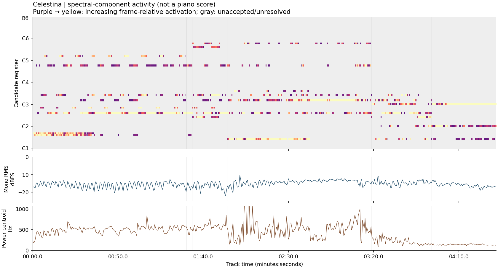

### 05. Counter Attack — 02:13.4

**Defining structure: D centered resonant material with E and chromatic neighbors.** D2 is the most consistent useful pitch anchor, with E2/E3 and intermittent F#2, A1, G2 and Eb2. A D-major profile is repeatedly returned, but low-frequency residue and intermodulation make a full major-key assertion too strong. The D/E relationship and changing noise envelope are more reliable reconstruction targets than a complete chord progression.

**Reconstruction:** Use P2 for D2 near its measured frequency, with E2/E3 resonances on a separate branch. Add the measured F#/A or Eb/G components by local activity, not all at once. Keep attack density low. In the live version this material is strongly matched over multiple windows; repeated phrases make exact source-cycle numbering ambiguous even when reuse is clear. Patch P2 is a proposed source/process initialization; per-track original instrument identity remains unknown unless independently cited above.

| Window / time | Supported pitch components: Hz (cents) | Key-profile fit, not confirmed key | Representative 0.5-s candidate snapshot |
| --- | --- | --- | --- |
| 01 · 00:00.0–01:30.0 | Eb1: 37.98 (-41.2); D2: 73.93 (+12.2); E2: 83.21 (+16.8); F#2: 92.45 (-0.9); E3: 166.05 (+13.0) | D major (r=0.50) | 00:41.0: D2, E3, F#2 |
| 02 · 01:30.0–01:35.5 | C#1: 34.77 (+5.9); A1: 54.80 (-6.4); E2: 83.41 (+21.0); F#2: 93.29 (+14.7); D3: 146.16 (-8.0) | D major (r=0.52) | 01:33.5: C#1, E2, D3, A1, F#2 |
| 03 · 01:35.5–02:13.4 | Eb1: 37.89 (-45.1); G1: 50.19 (+41.6); A1: 54.86 (-4.3); D2: 73.97 (+13.0); Eb2: 77.67 (-2.4); G2: 97.18 (-14.6) | D major (r=0.67) | 01:42.0: A1, D2, G2, G1 |

**Measured dynamics and texture.** Use these as section targets; retain the full envelopes for within-section motion.

| Window | RMS dBFS | Power centroid Hz | Side/mid dB | Flatness | Envelope period s (r) |
| --- | --- | --- | --- | --- | --- |
| 1 | -17.66 | 87.1 | -1.49 | 0.0 | 2.42 (0.19) |
| 2 | -16.21 | 112.6 | -1.6 | 0.0 | 1.92 (0.19) |
| 3 | -18.69 | 196.6 | -2.55 | 0.002 | 0.26 (0.12) |

The snapshot selects the densest supported candidate frame, not a typical or definitive chord. The pitch plot below is gated by the spectral-component mask; blank regions mean unresolved pitch evidence, not necessarily silence.

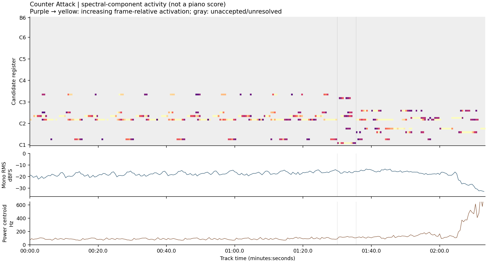

### 06. The Truth of Accountants — 02:21.1

**Defining structure: E A noise field followed by exposed C D E.** The first 84.5 seconds combine low A/E-region components with Eb and neighboring tones. Around 01:24.5, G-related components become more important. At 01:57 the spectrum changes markedly: C4/D4/C5/E4/E5 stand out. This last group continues into the opening palette of Aerial Light-Pollution Orange. The join can therefore be modeled as a carried upper pitch object rather than a wholly new instrument at the track marker.

**Reconstruction:** Use P3 for the initial low noisy state. Prepare a separate C4/D4/E4 object with upper octaves and transition it into prominence at about 01:57. Keep its attacks clearer than the preceding texture. Carry the same source bank into track 7; do not independently randomize its tuning between the two tracks. Patch P3 is a proposed source/process initialization; per-track original instrument identity remains unknown unless independently cited above.

| Window / time | Supported pitch components: Hz (cents) | Key-profile fit, not confirmed key | Representative 0.5-s candidate snapshot |
| --- | --- | --- | --- |
| 01 · 00:00.0–01:24.5 | C#1: 35.45 (+39.8); Eb1: 39.87 (+43.0); E1: 40.21 (-42.4); Ab1: 53.33 (+46.6); A1: 53.66 (-42.5); B1: 63.42 (+46.7); Eb2: 79.91 (+46.7); E2: 80.24 (-46.0) | E major (r=0.70) | 00:12.0: A1, E1, Eb2, Ab1, Eb1, C#1 |
| 02 · 01:24.5–01:57.0 | E1: 41.92 (+29.8); G1: 49.75 (+26.3); Eb2: 79.80 (+44.4); G2: 95.72 (-40.7); C#3: 141.08 (+30.8) | E minor (r=0.49) | 01:42.5: G1, E1, Eb2, C#3 |
| 03 · 01:57.0–02:21.1 | Eb2: 78.81 (+22.8); Bb2: 118.44 (+28.0); C4: 263.69 (+13.6); D4: 296.00 (+13.7); E4: 332.22 (+13.6); C5: 527.39 (+13.6); E5: 664.56 (+13.9) | C major (r=0.54) | 02:07.5: D4, C4, E5, Bb2, E4, Eb2 |

**Measured dynamics and texture.** Use these as section targets; retain the full envelopes for within-section motion.

| Window | RMS dBFS | Power centroid Hz | Side/mid dB | Flatness | Envelope period s (r) |
| --- | --- | --- | --- | --- | --- |
| 1 | -16.43 | 931.6 | -3.93 | 0.0045 | 0.12 (0.24) |
| 2 | -16.16 | 859.6 | -3.85 | 0.008 | 0.12 (0.07) |
| 3 | -19.42 | 880.1 | -2.79 | 0.0218 | 0.28 (0.12) |

The snapshot selects the densest supported candidate frame, not a typical or definitive chord. The pitch plot below is gated by the spectral-component mask; blank regions mean unresolved pitch evidence, not necessarily silence.

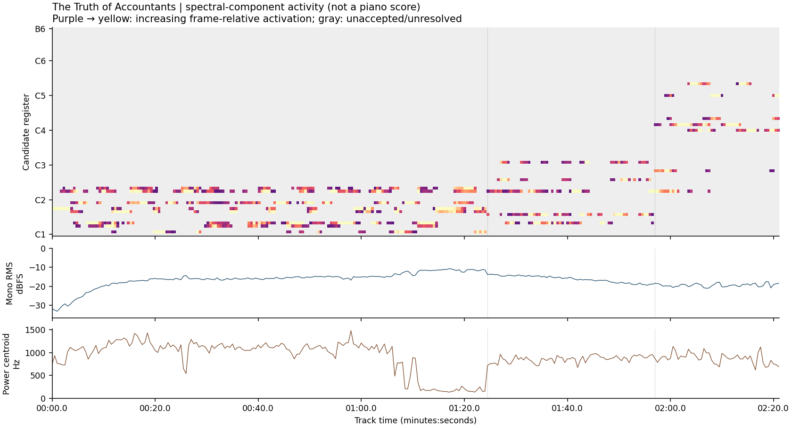

### 07. Aerial Light-Pollution Orange — 03:09.9

**Defining structure: Upper C D E gives way to a clear G minor voicing.** The first minute emphasizes C4/D4/E4 with octave-related C5/D5/E5 and other extensions. After about 01:05, the low G2–Bb2–D3 triad becomes highly explicit; F3 adds a minor seventh in some windows. Around 02:12.5–02:49, G2/Bb2/D3 is the cleanest compact reduction. Its peaks near 97.9, 116.5 and 146.9 Hz are close to equal-tempered G2/Bb2/D3. A4 returns late as a ninth above G.

**Reconstruction:** Use P1 for the first upper object, then cross prominence toward a P4 G2/Bb2/D3 body. Add F3 where supported and a separate A4 late. Preserve the change of register and density rather than simply changing a filter on one fixed pad. This is one of the stronger sections for a conventional harmonic reconstruction because the triad’s individual peaks are well supported. Patch P4 is a proposed source/process initialization; per-track original instrument identity remains unknown unless independently cited above.

| Window / time | Supported pitch components: Hz (cents) | Key-profile fit, not confirmed key | Representative 0.5-s candidate snapshot |
| --- | --- | --- | --- |
| 01 · 00:00.0–00:26.0 | Bb1: 59.20 (+27.5); D3: 149.31 (+29.0); C4: 263.73 (+13.9); D4: 295.97 (+13.5); E4: 332.20 (+13.5); G4: 395.14 (+13.8); C5: 527.40 (+13.7); D5: 591.95 (+13.6) | C major (r=0.62) | 00:01.0: C4, D4, Bb1, D3 |
| 02 · 00:26.0–00:47.5 | Bb1: 59.30 (+30.3); D3: 146.94 (+1.3); F3: 174.77 (+1.5); C4: 263.63 (+13.2); D4: 295.96 (+13.5); E4: 332.27 (+13.8); D5: 591.98 (+13.6); E5: 664.50 (+13.7) | D minor (r=0.77) | 00:45.5: F3, C4, D5, Bb1, D3, D4, E4 |
| 03 · 00:47.5–01:05.0 | Bb1: 59.23 (+28.3); D3: 146.92 (+1.1); A3: 220.27 (+2.1); C4: 263.67 (+13.5); D4: 296.01 (+13.8); G4: 395.16 (+13.9); D5: 592.00 (+13.7); E5: 664.56 (+13.9) | D minor (r=0.73) | 00:52.5: E5, D5, Bb1, D4, G4, D3 |
| 04 · 01:05.0–02:12.5 | Bb1: 59.23 (+28.3); G2: 97.93 (-1.3); Bb2: 116.49 (-0.8); D3: 146.90 (+0.8); F3: 174.81 (+2.0); E5: 664.59 (+13.9) | G minor (r=0.83) | 01:09.0: Bb2, G2, D3, F3, Bb1, E5 |
| 05 · 02:12.5–02:49.0 | G2: 97.89 (-1.9); Bb2: 116.47 (-1.0); D3: 146.93 (+1.2) | G minor (r=0.93) | 02:47.5: G2, Bb2, D3 |
| 06 · 02:49.0–03:09.9 | Bb1: 59.28 (+29.8); G2: 97.98 (-0.3); Bb2: 116.50 (-0.6); D3: 146.86 (+0.3); E4: 331.40 (+9.3); A4: 439.94 (-0.2); E5: 664.70 (+14.2) | G minor (r=0.78) | 02:50.0: G2, Bb2, A4, D3, E4, E5 |

**Measured dynamics and texture.** Use these as section targets; retain the full envelopes for within-section motion.

| Window | RMS dBFS | Power centroid Hz | Side/mid dB | Flatness | Envelope period s (r) |
| --- | --- | --- | --- | --- | --- |
| 1 | -17.79 | 702.7 | -3.59 | 0.0088 | 0.40 (0.27) |
| 2 | -16.85 | 587.0 | 0.59 | 0.0022 | 0.94 (0.12) |
| 3 | -17.64 | 569.5 | 1.06 | 0.0011 | 0.26 (0.20) |
| 4 | -15.34 | 366.5 | 0.38 | 0.0005 | 0.26 (0.26) |
| 5 | -17.97 | 220.6 | 0.55 | 0.0008 | 2.02 (0.18) |
| 6 | -18.78 | 548.5 | -2.77 | 0.0018 | 0.66 (0.10) |

The snapshot selects the densest supported candidate frame, not a typical or definitive chord. The pitch plot below is gated by the spectral-component mask; blank regions mean unresolved pitch evidence, not necessarily silence.

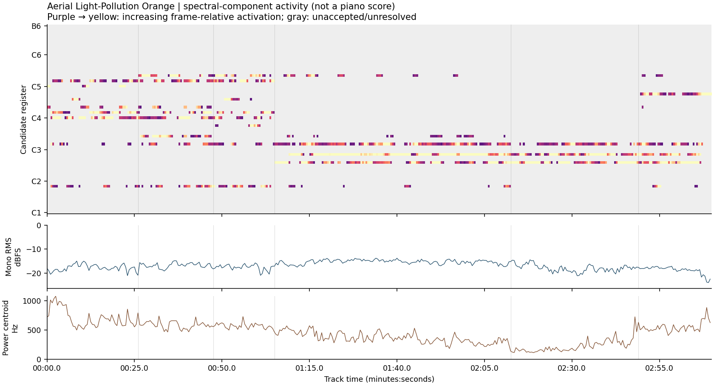

### 08. Non Mollare — 01:10.5

**Defining structure: A and E without a securely established third.** A4, E2/E3 and A1/A2 provide the most persistent pitch components. The resulting A/E relationship is an open fifth across registers. The A-minor key-profile result should not be expanded into an obligatory C-natural voice: the available section summary does not support doing so. Its role is a short sustained pitched object with considerable register separation.

**Reconstruction:** Use P2 or P4 with low A1/E2, middle E3/A2 where active, and a distant A4. Avoid a thick full minor chord. Use slow envelope transitions and let the measured amplitude trajectory shape the 70-second span. This is an economical source object suitable for a seam between denser tracks. Patch P2 is a proposed source/process initialization; per-track original instrument identity remains unknown unless independently cited above.

| Window / time | Supported pitch components: Hz (cents) | Key-profile fit, not confirmed key | Representative 0.5-s candidate snapshot |
| --- | --- | --- | --- |
| 01 · 00:00.0–01:10.5 | A1: 55.02 (+0.5); E2: 82.50 (+1.9); A2: 110.23 (+3.6); E3: 165.29 (+5.0); A4: 441.25 (+4.9) | A minor (r=0.83) | 00:29.0: A4, E2, E3, A2 |

**Measured dynamics and texture.** Use these as section targets; retain the full envelopes for within-section motion.

| Window | RMS dBFS | Power centroid Hz | Side/mid dB | Flatness | Envelope period s (r) |
| --- | --- | --- | --- | --- | --- |
| 1 | -21.29 | 518.1 | -6.01 | 0.0074 | 1.58 (0.08) |

The snapshot selects the densest supported candidate frame, not a typical or definitive chord. The pitch plot below is gated by the spectral-component mask; blank regions mean unresolved pitch evidence, not necessarily silence.

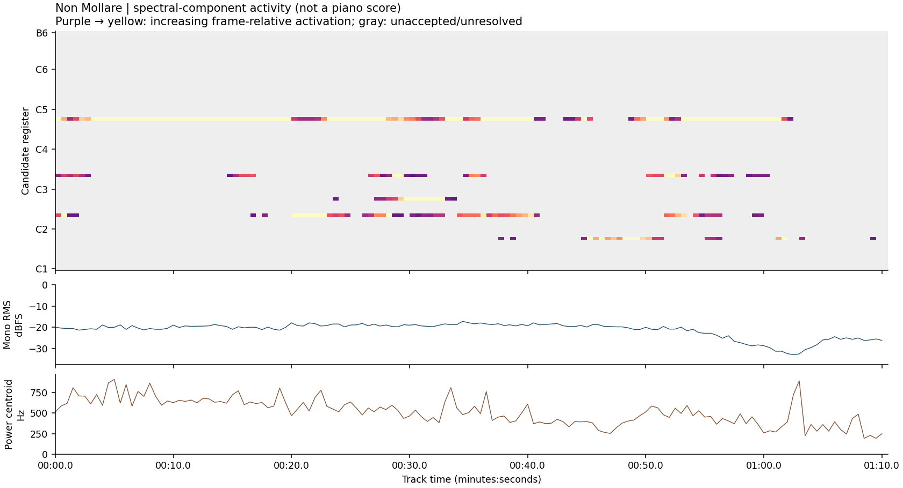

### 09. Kaito — 03:08.3

**Defining structure: B minor to F sharp minor material then C minor seven.** Until roughly 01:40.5, B1/D2/F#2/B2/D3 support B-minor material. The following 30 seconds emphasize F#2/F#3/F#4 with A2/A3, a clear F#–A minor-third relation. From 02:10.5 the low field changes to C2/Eb2, with G2/Bb2 especially clear in the ending. The final group supports Cm7. This is a genuine change of pitch collection; assigning B minor to the full track would lose the closing region.

**Reconstruction:** Use P3 for a guitar-like low source, with three distinct pitch states: B1/D2/F#2/B2/D3; F#2/A2/F#3/A3; and C2/Eb2/G2/Bb2. Treat these as state palettes, then use the activity map to decide simultaneity. In the final span, the narrow peaks near 65.28, 77.61, 97.78 and 116.37 Hz are direct tuning targets. Preserve each source’s sustain through processing. Patch P3 is a proposed source/process initialization; per-track original instrument identity remains unknown unless independently cited above.

| Window / time | Supported pitch components: Hz (cents) | Key-profile fit, not confirmed key | Representative 0.5-s candidate snapshot |
| --- | --- | --- | --- |
| 01 · 00:00.0–00:52.0 | B1: 61.78 (+1.2); D2: 73.53 (+2.7); F#2: 92.55 (+0.9); B2: 123.73 (+3.6); D3: 146.97 (+1.6) | B minor (r=0.84) | 00:35.5: D2, B1, D3, F#2 |
| 02 · 00:52.0–01:09.0 | B1: 61.39 (-9.8); D2: 73.57 (+3.6); F#2: 92.55 (+0.9); B2: 123.71 (+3.3); D3: 146.39 (-5.2) | B minor (r=0.93) | 01:08.5: D2, B2, B1, F#2 |
| 03 · 01:09.0–01:40.5 | B1: 61.75 (+0.5); D2: 73.55 (+3.1); F#2: 92.52 (+0.5); A2: 109.96 (-0.6); B2: 123.67 (+2.8); D3: 147.02 (+2.3) | B minor (r=0.81) | 01:39.0: D2, B1, D3, B2, F#2, A2 |
| 04 · 01:40.5–02:10.5 | F1: 44.84 (+46.3); F#1: 44.92 (-50.6); F#2: 92.55 (+0.9); A2: 109.97 (-0.5); C3: 129.25 (-20.8); F#3: 185.03 (+0.3); A3: 219.86 (-1.1); F#4: 369.93 (-0.3) | F# minor (r=0.74) | 02:08.5: A2, A3, F#3, F#4, F1, C3 |
| 05 · 02:10.5–02:35.5 | Eb1: 39.08 (+8.4); F#1: 47.47 (+45.0); G1: 47.61 (-49.9); C2: 65.24 (-4.3); Eb2: 77.61 (-3.7); G2: 97.79 (-3.7); C3: 129.27 (-20.5) | C minor (r=0.86) | 02:14.0: C2, Eb2, C3, Eb1, F#1, G1 |
| 06 · 02:35.5–03:08.3 | C2: 65.28 (-3.5); Eb2: 77.61 (-3.8); G2: 97.78 (-3.8); Bb2: 116.37 (-2.6) | C minor (r=0.83) | 02:36.5: Eb2, C2, Bb2, G2 |

**Measured dynamics and texture.** Use these as section targets; retain the full envelopes for within-section motion.

| Window | RMS dBFS | Power centroid Hz | Side/mid dB | Flatness | Envelope period s (r) |
| --- | --- | --- | --- | --- | --- |
| 1 | -16.17 | 169.3 | -6.07 | 0.0018 | 1.32 (0.35) |
| 2 | -17.49 | 305.8 | -4.91 | 0.0039 | 3.16 (0.14) |
| 3 | -16.13 | 201.0 | -5.47 | 0.0018 | 1.06 (0.31) |
| 4 | -16.95 | 215.2 | -3.0 | 0.0016 | 1.08 (0.19) |
| 5 | -17.38 | 149.7 | -3.23 | 0.0046 | 0.12 (0.21) |
| 6 | -18.62 | 201.9 | -9.47 | 0.0056 | 0.20 (0.13) |

The snapshot selects the densest supported candidate frame, not a typical or definitive chord. The pitch plot below is gated by the spectral-component mask; blank regions mean unresolved pitch evidence, not necessarily silence.

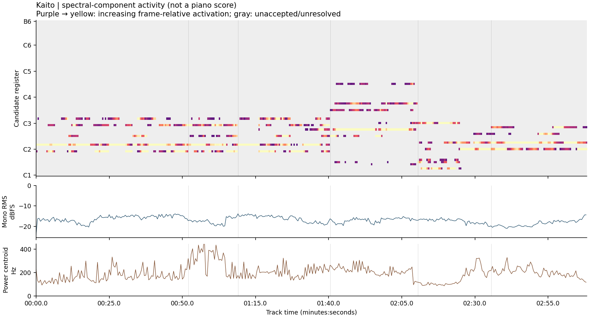

### 10. Balkanize-You — 08:39.2

**Defining structure: Low chromatic fields and a D Eb upper seam.** The early minutes move among low F/Gb/Eb, G/Ab/Bb/B, and related noise-resonant fields. From about 03:11 onward, G1/Ab1 underpin increasingly prominent D3; Eb3 later creates a close semitone above it. Around 07:22.5, the pitch balance changes toward G3/F3/B2/A2/E3. That last set can support a G-dominant extended reduction, but the earlier low clusters should not be forced into a chain of functional key changes.

**Reconstruction:** Use P3 for the first low blocks, then expose a separate P4 D3/Eb3 layer over G-region low content. Keep the semitone distinct on the cleaner branch while sending a copy into distortion. Replace the late upper body with B2/E3/F3/G3/A-related components as supported, rather than simply making the preceding noise louder. The live matching evidence is especially strong for a long part of this track. Patch P3 is a proposed source/process initialization; per-track original instrument identity remains unknown unless independently cited above.

| Window / time | Supported pitch components: Hz (cents) | Key-profile fit, not confirmed key | Representative 0.5-s candidate snapshot |
| --- | --- | --- | --- |
| 01 · 00:00.0–00:21.0 | Eb1: 39.87 (+43.0); F1: 44.81 (+45.1); F#1: 44.92 (-50.6); C2: 65.20 (-5.5); Eb2: 77.59 (-4.2); G2: 97.78 (-3.8); Bb2: 119.61 (+45.0); C#3: 135.10 (-44.2) | C minor (r=0.71) | 00:13.5: F1, F#1, C#3, Eb1, Bb2 |
| 02 · 00:21.0–00:37.0 | Eb1: 39.78 (+39.1); F1: 44.89 (+48.2); F#1: 44.92 (-50.6); Ab1: 51.09 (-27.5); Bb1: 59.39 (+32.9); C2: 66.30 (+23.5) | Bb minor (r=0.54) | 00:32.0: F1, F#1, C2 |
| 03 · 00:37.0–01:07.0 | G1: 49.96 (+33.7); Ab1: 51.28 (-21.4); Bb1: 58.98 (+21.0); B1: 60.18 (-44.3); C2: 66.77 (+35.8); C#2: 67.50 (-45.4); Eb3: 151.57 (-45.0); F3: 176.74 (+21.0) | G minor (r=0.52) | 00:38.0: G1, Ab1, Bb1, B1 |
| 04 · 01:07.0–01:38.0 | G1: 49.52 (+18.1); Ab1: 51.53 (-12.8); Bb1: 59.38 (+32.8); B1: 60.15 (-45.0); Eb2: 79.76 (+43.5); D3: 150.23 (+39.6); Eb3: 151.57 (-45.0) | Ab minor (r=0.56) | 01:27.0: G1, Ab1, Bb1, B1, D3, Eb3 |
| 05 · 01:38.0–01:54.0 | G1: 49.72 (+25.2); Ab1: 50.64 (-43.1); B1: 60.20 (-43.7) | G minor (r=0.61) | 01:49.5: G1, B1, Ab1 |
| 06 · 01:54.0–02:26.5 | F1: 44.58 (+36.2); F#1: 45.00 (-47.3); Ab1: 50.64 (-43.1); Bb1: 58.72 (+13.3); B1: 60.39 (-38.0) | Bb minor (r=0.59) | 02:08.5: Bb1, F1, F#1, B1 |
| 07 · 02:26.5–02:47.5 | Eb1: 39.87 (+43.0); E1: 40.21 (-42.4); G1: 49.96 (+33.7); Ab1: 50.67 (-42.1); Bb2: 117.56 (+15.0) | Ab minor (r=0.62) | 02:35.5: Ab1, E1, Eb1, G1, Bb2 |
| 08 · 02:47.5–03:11.0 | G1: 49.20 (+7.0); C#2: 67.68 (-40.9); D3: 149.16 (+27.3); F3: 174.73 (+1.1) | G minor (r=0.76) | 02:59.0: G1, D3 |
| 09 · 03:11.0–04:41.0 | G1: 49.55 (+19.2); Ab1: 50.64 (-43.1); D3: 148.46 (+19.1) | G minor (r=0.57) | 04:31.0: G1, Ab1, D3 |
| 10 · 04:41.0–06:11.0 | G1: 49.55 (+19.5); Ab1: 50.64 (-42.9); Eb2: 77.35 (-9.6); D3: 149.04 (+25.9); Eb3: 152.36 (-36.0) | G minor (r=0.57) | 05:03.5: D3, G1, Eb3, Ab1 |
| 11 · 06:11.0–07:22.5 | G1: 49.56 (+19.5); D3: 149.06 (+26.1); Eb3: 152.35 (-36.2) | D minor (r=0.52) | 07:03.0: D3, Eb3, G1 |
| 12 · 07:22.5–08:01.5 | A2: 110.35 (+5.5); B2: 123.41 (-0.8); E3: 165.76 (+9.9); F3: 174.72 (+1.1); G3: 196.10 (+0.9); D5: 589.52 (+6.4); A5: 883.54 (+7.0) | G major (r=0.70) | 07:37.0: G3, F3, B2, A2, A5 |
| 13 · 08:01.5–08:39.2 | G1: 49.50 (+17.6); Ab1: 50.64 (-43.1); A2: 110.32 (+5.0); B2: 123.42 (-0.7); E3: 164.96 (+1.6); F3: 174.74 (+1.3); G3: 196.10 (+0.9); D5: 589.57 (+6.6) | G major (r=0.72) | 08:07.0: G1, D5, F3, A2, Ab1, E3 |

**Measured dynamics and texture.** Use these as section targets; retain the full envelopes for within-section motion.

| Window | RMS dBFS | Power centroid Hz | Side/mid dB | Flatness | Envelope period s (r) |
| --- | --- | --- | --- | --- | --- |
| 1 | -14.58 | 315.0 | -8.54 | 0.0054 | 3.78 (0.17) |
| 2 | -14.21 | 380.0 | -7.25 | 0.0067 | 0.74 (0.12) |
| 3 | -14.13 | 523.2 | -5.28 | 0.0079 | 2.26 (0.14) |
| 4 | -13.78 | 537.0 | -4.64 | 0.0069 | 0.70 (0.17) |
| 5 | -12.08 | 343.8 | -4.79 | 0.0029 | 0.16 (0.26) |
| 6 | -12.49 | 397.3 | -4.12 | 0.0026 | 3.08 (0.17) |
| 7 | -12.62 | 288.4 | -4.17 | 0.0027 | 0.16 (0.18) |
| 8 | -13.35 | 577.7 | -2.68 | 0.0055 | 0.70 (0.15) |
| 9 | -12.47 | 170.7 | -4.56 | 0.0014 | 3.36 (0.23) |
| 10 | -14.38 | 348.1 | -0.21 | 0.0012 | 0.18 (0.11) |
| 11 | -19.7 | 254.3 | 1.11 | 0.0005 | 1.72 (0.11) |
| 12 | -22.74 | 387.4 | 2.99 | 0.0012 | 1.84 (0.06) |
| 13 | -31.02 | 462.7 | 1.79 | 0.0477 | 2.86 (-0.01) |

The snapshot selects the densest supported candidate frame, not a typical or definitive chord. The pitch plot below is gated by the spectral-component mask; blank regions mean unresolved pitch evidence, not necessarily silence.

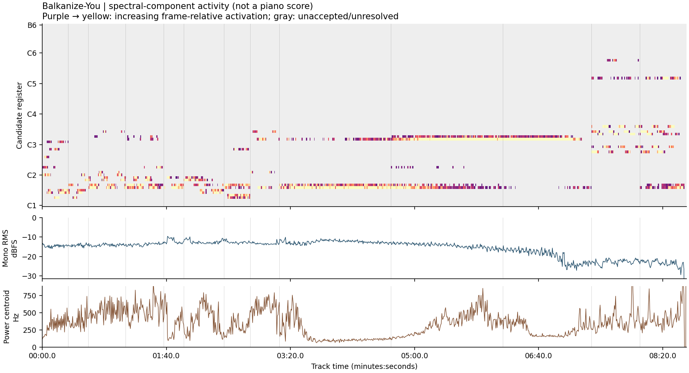

### 11. Incurably Optimistic! — 10:45.2

**Defining structure: C minor family with changing bass interpretations.** After the opening roughly 51 seconds, C3/Eb3/Bb3 with Bb2/Ab2 dominates long spans. With Ab2 lowest, Abadd9 is a plausible local reduction; with C as the anchor the same upper object belongs to a C-minor family. G3 becomes clearer around 06:02.5–06:27.5, supporting an explicit C-minor triad. Later D4 adds a ninth and G4/Eb4 becomes more exposed near the close. The title is not evidence of a major key.

**Reconstruction:** Use P4 with a stable C3/Eb3 inner pair and independently controlled Ab2/Bb2/C2/G2 bass possibilities. Add Bb3, then G3 or D4 only in their supported spans. Avoid retriggering all voices at each section boundary: carry the inner pair while the bass and density change. The clear frequencies near 130.84/155.55 Hz provide a consistent tuning reference through much of the piece. Patch P4 is a proposed source/process initialization; per-track original instrument identity remains unknown unless independently cited above.

| Window / time | Supported pitch components: Hz (cents) | Key-profile fit, not confirmed key | Representative 0.5-s candidate snapshot |
| --- | --- | --- | --- |
| 01 · 00:00.0–00:51.0 | Eb3: 158.14 (+28.5); G3: 200.17 (+36.4); Ab3: 202.38 (-44.5); Bb3: 238.58 (+40.4); Eb4: 317.22 (+33.6); G4: 398.70 (+29.4); Bb4: 477.14 (+40.3); B5: 1000.15 (+21.6) | Eb major (r=0.81) | 00:16.0: Eb3, Bb4, G3, B5, G4, Ab3, Eb4 |
| 02 · 00:51.0–01:48.5 | Eb2: 77.78 (-0.1); Ab2: 103.90 (+1.2); Bb2: 116.52 (-0.4); C3: 130.84 (+0.4); Eb3: 155.55 (-0.2); G3: 196.00 (-0.0); Bb3: 233.05 (-0.2) | C minor (r=0.87) | 01:18.0: C3, Eb3, Bb3, Bb2, Eb2, G3 |
| 03 · 01:48.5–02:22.5 | Ab2: 103.86 (+0.6); Bb2: 116.51 (-0.4); C3: 130.83 (+0.2); Eb3: 155.55 (-0.2); Bb3: 233.02 (-0.4) | C minor (r=0.84) | 02:11.5: C3, Eb3, Bb3, Bb2 |
| 04 · 02:22.5–02:45.5 | Ab2: 103.87 (+0.7); Bb2: 116.51 (-0.4); C3: 130.82 (+0.1); Eb3: 155.55 (-0.1); Bb3: 233.03 (-0.4) | C minor (r=0.83) | 02:35.0: C3, Eb3, Bb2, Bb3 |
| 05 · 02:45.5–03:27.0 | Ab2: 103.87 (+0.8); Bb2: 116.52 (-0.4); C3: 130.84 (+0.4); Eb3: 155.55 (-0.1); Bb3: 233.03 (-0.4) | C minor (r=0.73) | 03:14.0: C3, Bb2, Eb3, Bb3 |
| 06 · 03:27.0–04:32.5 | Ab2: 103.88 (+1.0); Bb2: 116.52 (-0.4); C3: 130.83 (+0.2); Eb3: 155.56 (-0.1); Bb3: 233.05 (-0.2) | C minor (r=0.85) | 03:58.5: C3, Eb3, Bb2, Bb3 |
| 07 · 04:32.5–06:02.5 | Ab2: 103.87 (+0.7); Bb2: 116.51 (-0.4); C3: 130.82 (+0.1); Eb3: 155.54 (-0.3); Bb3: 233.06 (-0.1) | C minor (r=0.84) | 05:57.5: C3, Bb3, Eb3, Bb2 |
| 08 · 06:02.5–06:06.0 | Bb2: 116.57 (+0.4); C3: 130.82 (+0.1); Eb3: 155.57 (+0.0); G3: 195.95 (-0.5) | C minor (r=0.85) | 06:05.5: C3, Eb3, G3 |
| 09 · 06:06.0–06:27.5 | C2: 65.36 (-1.2); C3: 130.87 (+0.7); Eb3: 155.55 (-0.1); G3: 195.99 (-0.0) | C minor (r=0.89) | 06:13.0: Eb3, C3, G3, C2 |
| 10 · 06:27.5–07:12.5 | F1: 43.11 (-21.8); G2: 97.98 (-0.3); Ab2: 103.81 (-0.3); Bb2: 116.51 (-0.4); C3: 130.81 (-0.0); Eb3: 155.56 (-0.1); Bb3: 233.02 (-0.5) | C minor (r=0.90) | 07:04.0: C3, Eb3, Bb2, G2, Bb3, F1 |
| 11 · 07:12.5–07:39.0 | C2: 65.36 (-1.2); G2: 97.96 (-0.7); Ab2: 103.89 (+1.1); C3: 130.87 (+0.7); Eb3: 155.55 (-0.2); G3: 195.99 (-0.0); Bb3: 233.04 (-0.3) | C minor (r=0.80) | 07:33.5: G3, Eb3, C2, Bb3, G2, Ab2 |
| 12 · 07:39.0–07:56.5 | G2: 98.02 (+0.4); Bb2: 116.51 (-0.4); C3: 130.85 (+0.5); Eb3: 155.54 (-0.2); Bb3: 233.05 (-0.3); D4: 293.70 (+0.2); G4: 391.29 (-3.1) | Eb major (r=0.84) | 07:48.5: Eb3, D4, Bb2, G2, Bb3 |
| 13 · 07:56.5–08:32.5 | F1: 43.09 (-22.4); G2: 98.02 (+0.3); Bb2: 116.51 (-0.4); C3: 130.85 (+0.5); Eb3: 155.54 (-0.2); Bb3: 233.04 (-0.3); G4: 391.28 (-3.2) | Bb major (r=0.66) | 08:28.0: F1, C3, Eb3, Bb3, G4, G2, Bb2 |
| 14 · 08:32.5–08:57.0 | G2: 98.09 (+1.6); Ab2: 103.89 (+1.1); Bb2: 116.52 (-0.4); C3: 130.86 (+0.6); Eb3: 155.55 (-0.2); Bb3: 233.06 (-0.2); G4: 391.30 (-3.1) | C minor (r=0.87) | 08:44.5: Eb3, Bb2, Bb3, G2, Ab2 |
| 15 · 08:57.0–10:07.5 | G2: 97.95 (-0.8); Bb2: 116.52 (-0.3); C3: 130.84 (+0.4); Eb3: 155.55 (-0.2); Bb3: 233.04 (-0.3); D4: 293.68 (+0.1); G4: 391.30 (-3.1) | C minor (r=0.87) | 09:58.5: C3, Eb3, Bb3, D4, G2, Bb2, G4 |
| 16 · 10:07.5–10:45.2 | G2: 97.87 (-2.2); C3: 130.84 (+0.3); Eb3: 155.54 (-0.2); Bb3: 232.97 (-0.9); D4: 293.28 (-2.2); Eb4: 310.51 (-3.4); G4: 391.27 (-3.2) | C minor (r=0.83) | 10:09.5: G4, Eb3, C3, Eb4, Bb3, D4 |

**Measured dynamics and texture.** Use these as section targets; retain the full envelopes for within-section motion.

| Window | RMS dBFS | Power centroid Hz | Side/mid dB | Flatness | Envelope period s (r) |
| --- | --- | --- | --- | --- | --- |
| 1 | -21.04 | 765.0 | -8.7 | 0.0054 | 2.08 (0.11) |
| 2 | -16.79 | 466.2 | -2.79 | 0.0045 | 3.28 (0.10) |
| 3 | -14.5 | 324.1 | -0.51 | 0.0044 | 3.28 (0.11) |
| 4 | -14.42 | 246.8 | -0.28 | 0.0018 | 1.38 (0.32) |
| 5 | -14.39 | 241.2 | -0.0 | 0.0017 | 1.38 (0.44) |
| 6 | -14.36 | 235.4 | -0.59 | 0.0022 | 1.38 (0.30) |
| 7 | -13.79 | 244.7 | -0.29 | 0.0024 | 1.38 (0.29) |
| 8 | -13.64 | 221.6 | -0.17 | 0.0026 | 1.42 (0.43) |
| 9 | -13.82 | 259.9 | -1.43 | 0.003 | 1.38 (0.57) |
| 10 | -13.65 | 254.2 | -0.95 | 0.0037 | 1.36 (0.31) |
| 11 | -16.41 | 772.2 | -2.31 | 0.0321 | 0.12 (0.25) |
| 12 | -16.84 | 844.6 | -1.62 | 0.0379 | 0.20 (0.17) |
| 13 | -16.87 | 819.5 | -2.42 | 0.0377 | 2.82 (0.10) |
| 14 | -16.97 | 954.2 | -2.22 | 0.0477 | 0.10 (0.18) |
| 15 | -17.18 | 777.7 | -2.45 | 0.04 | 2.96 (0.07) |
| 16 | -36.79 | 1467.6 | -3.71 | 0.0802 | 3.96 (-0.01) |

The snapshot selects the densest supported candidate frame, not a typical or definitive chord. The pitch plot below is gated by the spectral-component mask; blank regions mean unresolved pitch evidence, not necessarily silence.

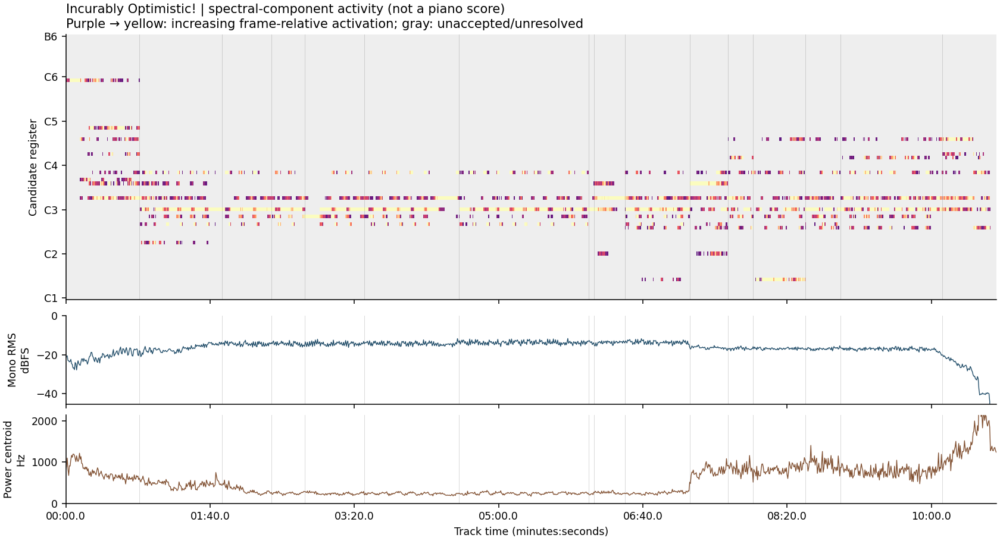

## Mort aux Vaches: track-by-track measured reconstruction

### 01. Untitled — 40:43.9

**Defining structure: Live recomposition of identifiable Mirages materials.** The strongest retrieved regions correspond to Neither More nor Less, Aerial Silver, Celestina, Counter Attack and Balkanize-You, with different evidence strengths. The B/D/F# material around 19–21 minutes is compatible with Kaito but does not achieve the same temporal matching strength. The final C/Eb-related span resembles several studio objects and remains unassigned. The dataset retains competing matches instead of forcing every live minute into a studio title.

**Reconstruction:** Use the matched studio source objects as starting material. For Celestina and Balkanize-You, preserve near-original event rate where the waveform checks support it; create the live differences by layer balance, duration and overlays. Counter Attack contains repeated material whose exact source-cycle mapping is nonunique. Keep unresolved intro, seams and ending as independent objects rather than declaring them verified remixes of named tracks. Patch P2 is a proposed source/process initialization; per-track original instrument identity remains unknown unless independently cited above.

| Window / time | Supported pitch components: Hz (cents) | Key-profile fit, not confirmed key | Representative 0.5-s candidate snapshot |
| --- | --- | --- | --- |
| 01 · 00:00.0–01:30.0 | G5: 787.79 (+8.4) | Withheld: insufficient supported components | 00:14.0: G5 |
| 02 · 01:30.0–02:14.5 | B1: 60.06 (-47.7) | Withheld: insufficient supported components | 01:35.0: B1 |
| 03 · 02:14.5–02:58.5 | G1: 49.68 (+24.0); C2: 65.67 (+7.0); D2: 73.50 (+1.9); F2: 87.51 (+4.0); G2: 96.55 (-25.8); Bb4: 468.57 (+8.9); C5: 525.98 (+9.0); F5: 702.18 (+9.2) | C major (r=0.76) | 02:33.5: G2, C5, F2, C2, F5, D2 |
| 04 · 02:58.5–03:36.0 | C2: 64.71 (-18.5); D2: 73.49 (+1.7); F2: 86.24 (-21.3); G2: 98.14 (+2.5); C3: 131.45 (+8.4); Bb4: 468.78 (+9.7); C5: 525.97 (+9.0); F5: 702.22 (+9.3) | F major (r=0.75) | 03:18.0: C2, G2, F2, F5, D2, Bb4, C5 |
| 05 · 03:36.0–04:02.0 | C2: 64.63 (-20.7); F2: 87.62 (+6.2); G2: 98.21 (+3.7); C3: 131.32 (+6.8); Bb3: 234.96 (+13.9); Bb4: 468.71 (+9.4); C5: 526.05 (+9.2); F5: 702.27 (+9.4) | F major (r=0.83) | 03:48.5: G2, C2, F5, C3, C5, Bb3 |
| 06 · 04:02.0–04:29.0 | F1: 43.45 (-8.3); G1: 49.91 (+31.9); C2: 64.70 (-18.7); D2: 73.46 (+0.9); G2: 97.24 (-13.5); Ab2: 104.53 (+11.7); Bb2: 117.32 (+11.6); G3: 198.07 (+18.2) | C major (r=0.76) | 04:26.0: C2, D2, G1, Ab2, G3 |
| 07 · 04:29.0–05:17.5 | F2: 89.67 (+46.1); G2: 97.13 (-15.4); C3: 131.24 (+5.7); G4: 395.05 (+13.4); Bb4: 469.10 (+10.9); C5: 526.55 (+10.9); F5: 702.74 (+10.6) | F major (r=0.82) | 04:58.0: Bb4, F5, C5, G4, F2, C3 |
| 08 · 05:17.5–05:48.5 | G1: 49.82 (+28.6); C2: 64.59 (-21.8); D2: 73.48 (+1.5); F2: 89.67 (+46.1); G2: 98.03 (+0.6) | C major (r=0.77) | 05:43.0: C2, F2, G1, G2, D2 |
| 09 · 05:48.5–07:05.5 | G1: 49.74 (+25.8); C2: 64.43 (-26.1); F2: 85.04 (-45.5); G2: 97.10 (-16.0) | C major (r=0.66) | 05:49.5: G1, F2, C2, G2 |
| 10 · 07:05.5–07:31.0 | D2: 73.89 (+11.1); C#3: 141.26 (+33.0); F3: 177.71 (+30.4) | C# major (r=0.48) | 07:09.5: D2, C#3 |
| 11 · 07:31.0–08:29.0 | G1: 50.30 (+45.4); Ab1: 50.64 (-43.0); B1: 60.18 (-44.3); G2: 99.25 (+22.0) | Ab minor (r=0.56) | 08:14.0: Ab1, G1, B1, G2 |
| 12 · 08:29.0–09:59.0 | G1: 50.30 (+45.4); Ab1: 50.64 (-43.1); B1: 60.08 (-47.1); Eb3: 151.57 (-45.0) | Ab minor (r=0.42) | 09:40.0: G1, Ab1, B1, Eb3 |
| 13 · 09:59.0–10:00.5 | Ab1: 50.85 (-35.9); Bb1: 59.72 (+42.6); B1: 60.06 (-47.7) | Ab minor (r=0.60) | 10:00.0: Ab1, Bb1 |
| 14 · 10:00.5–10:17.5 | F1: 44.92 (+49.4); F#1: 45.00 (-47.3); G1: 49.96 (+33.7); Ab1: 50.64 (-43.1); B1: 60.18 (-44.2) | Ab minor (r=0.70) | 10:05.0: Ab1, B1, G1, F#1, F1 |
| 15 · 10:17.5–10:50.0 | G1: 50.30 (+45.4); Ab1: 50.64 (-43.1); Bb1: 59.38 (+32.8); B1: 60.06 (-47.6) | Ab minor (r=0.46) | 10:26.0: G1, Ab1, B1, Bb1 |
| 16 · 10:50.0–12:20.0 | G1: 50.23 (+43.1); Ab1: 50.64 (-43.1) | Ab minor (r=0.54) | 10:59.0: Ab1, G1 |
| 17 · 12:20.0–12:35.5 | F1: 44.92 (+49.4); F#1: 45.14 (-42.0); G1: 50.30 (+45.4); Ab1: 50.64 (-43.1); Bb1: 59.72 (+42.6); B1: 60.06 (-47.7) | Ab minor (r=0.64) | 12:21.5: Ab1, G1, B1, Bb1, F#1, F1 |
| 18 · 12:35.5–12:53.5 | C#1: 34.03 (-31.2); F1: 44.92 (+49.4); F#1: 45.05 (-45.5); G1: 50.30 (+45.4); Ab1: 50.64 (-43.1); Bb1: 59.72 (+42.6); B1: 60.06 (-47.7) | Ab minor (r=0.72) | 12:40.5: B1, Ab1, G1, Bb1, C#1 |
| 19 · 12:53.5–13:46.0 | Ab5: 832.69 (+4.3); B5: 1000.22 (+21.7); A6: 1794.01 (+33.1) | Eb major (r=0.44) | 13:33.0: B5, Ab5, A6 |
| 20 · 13:46.0–14:20.5 | A4: 451.45 (+44.5); Bb4: 455.92 (-38.5); F5: 681.71 (-42.0); C#6: 1135.21 (+40.9); G6: 1571.14 (+3.5); A6: 1794.00 (+33.1); Bb6: 1912.75 (+44.1) | Bb minor (r=0.75) | 14:01.0: Bb6, F5, A4, Bb4, C#6, G6, A6 |
| 21 · 14:20.5–14:50.5 | G2: 98.26 (+4.7); C3: 131.15 (+4.4); D3: 147.36 (+6.2); F3: 175.05 (+4.3); A4: 442.25 (+8.8); D5: 590.11 (+8.2); G5: 787.91 (+8.6); A5: 884.30 (+8.4) | G minor (r=0.74) | 14:40.0: G2, A5, G5, F3, D3, A4 |
| 22 · 14:50.5–16:20.5 | G2: 98.26 (+4.7); Bb2: 116.80 (+3.9); D3: 147.45 (+7.3); F3: 175.15 (+5.3); A4: 442.28 (+9.0); C5: 525.81 (+8.5); G5: 787.85 (+8.5); A5: 884.31 (+8.5) | G minor (r=0.77) | 15:20.5: G2, G5, F3, D3, A4, Bb2, A5, C5 |
| 23 · 16:20.5–17:35.0 | F1: 43.08 (-22.9); G2: 98.27 (+4.8); D3: 147.63 (+9.4); F3: 175.28 (+6.6); A4: 442.23 (+8.8); G5: 787.91 (+8.6); A5: 884.94 (+9.7) | D minor (r=0.82) | 16:52.0: F1, D3, G5, A5, A4, G2, F3 |
| 24 · 17:35.0–19:05.0 | G1: 49.79 (+27.6); G2: 100.01 (+35.2); D3: 147.64 (+9.5); F3: 175.54 (+9.1); G5: 787.95 (+8.7); A5: 885.06 (+9.9) | D minor (r=0.75) | 18:04.5: D3, G2, F3, G1, G5, A5 |
| 25 · 19:05.0–19:46.5 | Bb1: 59.63 (+40.0); G2: 100.02 (+35.4); Bb2: 119.21 (+39.3); D3: 147.53 (+8.3) | B minor (r=0.65) | 19:18.5: D3, Bb1, Bb2, G2 |
| 26 · 19:46.5–20:30.5 | Bb1: 59.72 (+42.6); B1: 60.06 (-47.7); F2: 88.43 (+22.1); F#2: 90.48 (-38.2); D3: 146.07 (-9.0); F#3: 188.18 (+29.5); Ab3: 209.09 (+12.0) | B minor (r=0.76) | 20:05.5: B1, D3, Bb1, F#2, F2, Ab3 |
| 27 · 20:30.5–20:57.5 | Bb1: 59.72 (+42.6); B1: 60.06 (-47.7); F2: 88.12 (+15.9); D3: 147.91 (+12.6); F#3: 189.15 (+38.5) | F# major (r=0.59) | 20:56.0: F#3, D3, B1, Bb1, F2 |
| 28 · 20:57.5–21:56.0 | Bb1: 59.72 (+42.6); B1: 60.39 (-38.0); F#2: 91.17 (-25.1); D3: 145.99 (-9.9) | F# major (r=0.76) | 21:17.5: B1, F#2, Bb1, D3 |
| 29 · 21:56.0–23:26.0 | Eb1: 37.95 (-42.3); G1: 49.42 (+14.7); D2: 73.94 (+12.2); E2: 83.23 (+17.3); E3: 166.06 (+13.1) | D major (r=0.58) | 22:37.5: D2, Eb1, G1, E3 |
| 30 · 23:26.0–24:19.5 | Eb1: 37.88 (-45.6); G1: 49.40 (+14.0); D2: 73.93 (+12.1); E2: 83.23 (+17.3); E3: 164.31 (-5.3) | D major (r=0.61) | 23:27.0: D2, G1, E3 |
| 31 · 24:19.5–24:34.5 | D2: 73.93 (+12.1); Eb2: 75.91 (-42.1); E2: 83.30 (+18.6); G2: 97.17 (-14.7); E3: 164.37 (-4.7) | D major (r=0.64) | 24:31.0: D2, Eb2, G2 |
| 32 · 24:34.5–24:51.0 | G1: 50.10 (+38.5); D2: 73.96 (+12.8); Eb2: 75.87 (-43.1); G2: 97.31 (-12.3); E3: 166.02 (+12.7) | D major (r=0.65) | 24:41.0: D2, G2, G1, E3 |
| 33 · 24:51.0–25:21.0 | Eb1: 37.95 (-42.3); D2: 73.95 (+12.6); E2: 83.22 (+17.0); E3: 166.06 (+13.1) | D major (r=0.59) | 25:15.0: D2, E2, Eb1, E3 |
| 34 · 25:21.0–26:14.0 | Eb1: 39.87 (+43.0); F1: 44.92 (+49.4); F#1: 45.05 (-45.6); Ab1: 50.99 (-31.1); Bb2: 119.61 (+45.0); B2: 120.37 (-44.0) | Eb minor (r=0.75) | 25:21.0: F1, Eb1, Ab1, Bb2, B2 |
| 35 · 26:14.0–26:31.5 | Eb1: 39.79 (+39.5); F1: 44.92 (+49.4); F#1: 45.01 (-46.9); G1: 49.86 (+30.1); Ab1: 50.91 (-33.9); Bb1: 59.42 (+33.9); Bb2: 119.50 (+43.5) | Eb minor (r=0.83) | 26:15.5: F#1, Eb1, F1, Bb2, Ab1, G1 |
| 36 · 26:31.5–27:01.5 | F1: 44.92 (+49.4); F#1: 44.99 (-47.8); G1: 49.88 (+30.9); Ab1: 51.09 (-27.5); Bb1: 59.01 (+21.7); B1: 60.20 (-43.7); C2: 66.77 (+35.8) | Eb major (r=0.62) | 26:47.0: G1, Ab1, Bb1, B1, F1 |
| 37 · 27:01.5–27:32.5 | Eb1: 39.83 (+41.2); G1: 50.30 (+45.4); Ab1: 50.64 (-43.1); Bb1: 59.38 (+32.8); B1: 60.15 (-45.1); D3: 150.23 (+39.6); Eb3: 151.57 (-45.0) | Ab minor (r=0.74) | 27:21.0: Ab1, G1, B1, Bb1, Eb1, Eb3 |
| 38 · 27:32.5–27:48.5 | G1: 49.61 (+21.6); Ab1: 50.66 (-42.4); B1: 60.20 (-43.5) | Ab minor (r=0.48) | 27:38.5: G1, B1, Ab1 |
| 39 · 27:48.5–28:19.5 | F1: 44.86 (+47.2); F#1: 44.92 (-50.6); G1: 49.96 (+33.7); Ab1: 50.74 (-39.5); Bb1: 58.64 (+11.1); B1: 60.93 (-22.6) | Bb minor (r=0.40) | 28:03.5: Bb1, B1, Ab1, F#1, F1 |
| 40 · 28:19.5–28:48.0 | Eb1: 39.87 (+43.0); E1: 40.21 (-42.4); G1: 49.95 (+33.2); Ab1: 50.67 (-42.0); Bb1: 59.72 (+42.6); B1: 60.14 (-45.4); Bb2: 118.69 (+31.6) | Ab minor (r=0.63) | 28:29.0: Ab1, E1, Bb1, B1, Eb1, Bb2 |
| 41 · 28:48.0–29:04.5 | G1: 49.25 (+8.8); B1: 60.85 (-24.9); Eb2: 77.09 (-15.5); D3: 149.15 (+27.1) | G minor (r=0.76) | 28:54.0: G1, D3, Eb2 |
| 42 · 29:04.5–30:34.5 | G1: 49.57 (+20.1); Ab1: 50.64 (-43.1) | G minor (r=0.53) | 30:04.5: G1, Ab1 |
| 43 · 30:34.5–31:02.5 | G1: 49.57 (+20.1); Ab1: 50.64 (-43.0); D2: 75.09 (+39.0); Eb2: 77.36 (-9.4); D3: 148.86 (+23.7); Eb3: 151.57 (-45.0) | G minor (r=0.63) | 31:01.0: G1, Ab1, D3, Eb3, D2 |
| 44 · 31:02.5–31:34.0 | G1: 49.72 (+25.4); B1: 60.06 (-47.7); D3: 148.83 (+23.4); Eb3: 152.24 (-37.4) | G minor (r=0.52) | 31:17.0: D3, G1, Eb3, B1 |
| 45 · 31:34.0–32:01.5 | G1: 49.86 (+30.3); D3: 149.69 (+33.4); Eb3: 152.22 (-37.6); D5: 597.23 (+28.9); F#5: 740.50 (+1.2); A5: 901.04 (+40.9); C6: 1034.69 (-19.7); D6: 1183.35 (+12.8) | D major (r=0.65) | 31:37.0: D3, Eb3, F#5, A5, G1, D6, C6 |
| 46 · 32:01.5–32:49.5 | Eb2: 77.83 (+1.1); Ab2: 103.85 (+0.4); Bb2: 116.57 (+0.4); B5: 1000.24 (+21.7) | C minor (r=0.82) | 32:40.5: Ab2, Bb2 |
| 47 · 32:49.5–33:08.0 | C2: 65.53 (+3.2); Ab2: 103.81 (-0.2); G3: 196.02 (+0.2) | Ab major (r=0.70) | 32:50.0: G3, C2 |
| 48 · 33:08.0–33:41.5 | G2: 98.04 (+0.7); Ab2: 103.83 (+0.1); Eb3: 155.61 (+0.5); G4: 392.00 (+0.0) | C minor (r=0.93) | 33:28.5: G2, Ab2, G4 |
| 49 · 33:41.5–34:00.0 | G2: 98.07 (+1.2); Ab2: 103.85 (+0.4); Bb3: 233.12 (+0.3) | Ab major (r=0.43) | 33:52.5: Ab2, Bb3 |
| 50 · 34:00.0–34:34.0 | C2: 65.28 (-3.3); F2: 87.32 (+0.3); G2: 98.04 (+0.8); Ab2: 103.81 (-0.3); C3: 130.65 (-2.1); G4: 391.45 (-2.4) | C minor (r=0.93) | 34:10.0: C2, C3, Ab2, G4 |
| 51 · 34:34.0–35:02.5 | F1: 43.22 (-17.3); F#1: 44.92 (-50.6); C2: 65.16 (-6.5); Eb2: 78.28 (+11.0); F2: 86.35 (-19.1) | F minor (r=0.72) | 34:47.5: F1, Eb2, C2, F2, F#1 |
| 52 · 35:02.5–35:45.5 | F1: 43.97 (+12.6); Bb1: 58.61 (+10.1); C2: 65.40 (-0.1); Eb2: 77.87 (+2.0); G2: 97.72 (-5.0) | C minor (r=0.89) | 35:38.0: C2, G2, Bb1, Eb2 |
| 53 · 35:45.5–36:06.5 | E1: 41.79 (+24.6); C2: 65.57 (+4.4); Eb2: 78.31 (+11.7); F2: 87.26 (-1.0); F#2: 90.30 (-41.6); G2: 97.88 (-2.0); Eb5: 622.07 (-0.5) | F minor (r=0.54) | 35:49.0: C2, E1, Eb2, F2, F#2 |
| 54 · 36:06.5–36:25.5 | Eb1: 38.87 (-0.9); C2: 65.68 (+7.1); Eb2: 77.84 (+1.4); C3: 130.69 (-1.6); Eb4: 311.18 (+0.3); G4: 391.91 (-0.4); Eb5: 622.58 (+0.9) | Eb major (r=0.74) | 36:18.0: Eb1, Eb2, C2, Eb5, C3, Eb4 |
| 55 · 36:25.5–36:48.0 | Eb1: 38.56 (-14.9); F1: 44.92 (+49.4); F#1: 44.96 (-48.8); Eb2: 78.12 (+7.6); F2: 89.67 (+46.1); F#2: 90.00 (-47.4); Ab6: 1659.40 (-1.9) | F minor (r=0.50) | 36:45.0: F1, F#1, F2, F#2 |
| 56 · 36:48.0–37:03.0 | C2: 65.28 (-3.4); G2: 98.01 (+0.2) | C minor (r=0.84) | 36:50.0: C2, G2 |
| 57 · 37:03.0–37:20.0 | C2: 65.21 (-5.2); G2: 97.85 (-2.6); C3: 131.60 (+10.4); Eb3: 155.68 (+1.3); Eb4: 312.91 (+9.9); Eb5: 621.46 (-2.2); B5: 1000.20 (+21.7); Eb6: 1242.52 (-2.8) | C minor (r=0.83) | 37:15.5: G2, Eb5, C2, C3, Eb3, Eb4 |
| 58 · 37:20.0–38:44.5 | F1: 44.92 (+49.4); C2: 65.28 (-3.3); Eb2: 78.04 (+5.8); F2: 89.67 (+46.1); G2: 97.99 (-0.1); C3: 129.02 (-23.8); Eb4: 310.98 (-0.8); Eb5: 621.17 (-3.0) | C minor (r=0.79) | 37:57.5: G2, C3, C2, F1, Eb4, Eb5, F2 |
| 59 · 38:44.5–39:31.5 | Eb2: 78.06 (+6.1); G2: 98.00 (-0.0); C3: 129.03 (-23.8) | C minor (r=0.67) | 39:11.5: G2, C3, Eb2 |
| 60 · 39:31.5–40:43.9 | F1: 44.92 (+49.4); F#1: 45.01 (-47.0); C2: 65.35 (-1.4); Eb2: 78.02 (+5.3); G2: 97.99 (-0.2) | C major (r=0.61) | 40:32.0: G2, F1, Eb2, F#1, C2 |

**Measured dynamics and texture.** Use these as section targets; retain the full envelopes for within-section motion.

| Window | RMS dBFS | Power centroid Hz | Side/mid dB | Flatness | Envelope period s (r) |
| --- | --- | --- | --- | --- | --- |
| 1 | -49.67 | 1656.9 | -3.79 | 0.1384 | 3.26 (0.04) |
| 2 | -45.11 | 1634.4 | -5.1 | 0.088 | 2.00 (0.34) |
| 3 | -40.79 | 908.9 | -3.25 | 0.0538 | 2.00 (0.32) |
| 4 | -32.08 | 802.2 | -3.15 | 0.0296 | 0.10 (0.35) |
| 5 | -30.31 | 463.0 | -0.76 | 0.0121 | 1.74 (0.12) |
| 6 | -24.78 | 255.0 | -3.72 | 0.0047 | 0.20 (0.23) |
| 7 | -24.94 | 514.1 | -0.79 | 0.0012 | 0.24 (0.08) |
| 8 | -22.49 | 113.1 | 0.48 | 0.0001 | 3.66 (0.14) |
| 9 | -21.44 | 55.1 | 0.73 | 0.0001 | 0.24 (0.24) |
| 10 | -21.07 | 70.3 | 0.81 | 0.0001 | 0.12 (0.24) |
| 11 | -21.68 | 131.2 | -0.82 | 0.0005 | 2.64 (0.08) |
| 12 | -17.2 | 287.8 | -4.82 | 0.0015 | 2.30 (0.12) |
| 13 | -18.27 | 249.0 | -8.08 | 0.0013 | 0.12 (0.20) |
| 14 | -19.78 | 289.3 | -5.14 | 0.0016 | 2.36 (0.21) |
| 15 | -24.52 | 303.8 | -5.81 | 0.0021 | 0.12 (0.22) |
| 16 | -22.18 | 57.2 | -1.6 | 0.0 | 3.86 (0.07) |
| 17 | -19.77 | 122.5 | -0.71 | 0.0001 | 0.10 (0.33) |
| 18 | -26.02 | 924.7 | -1.15 | 0.0354 | 3.64 (0.17) |
| 19 | -40.65 | 2856.9 | -3.1 | 0.1435 | 3.06 (0.14) |
| 20 | -31.31 | 2441.0 | -2.32 | 0.0678 | 2.94 (0.09) |
| 21 | -29.66 | 1999.6 | -2.31 | 0.0507 | 2.46 (0.18) |
| 22 | -33.18 | 709.9 | -2.0 | 0.0044 | 2.50 (0.29) |
| 23 | -30.39 | 621.8 | -1.19 | 0.0063 | 2.42 (0.17) |
| 24 | -25.82 | 426.5 | -0.87 | 0.0035 | 2.08 (0.12) |
| 25 | -29.42 | 411.8 | -1.18 | 0.0073 | 1.98 (0.13) |
| 26 | -29.21 | 309.4 | -3.48 | 0.0053 | 3.06 (0.06) |
| 27 | -33.64 | 141.7 | -4.14 | 0.0 | 0.20 (0.23) |
| 28 | -36.29 | 61.1 | -3.66 | 0.0 | 0.20 (0.23) |
| 29 | -31.08 | 98.1 | -0.83 | 0.0 | 0.26 (0.15) |
| 30 | -29.28 | 115.6 | -0.74 | 0.0 | 0.14 (0.18) |
| 31 | -33.86 | 157.1 | -0.74 | 0.0001 | 0.10 (0.12) |
| 32 | -29.68 | 153.4 | -19.54 | 0.0001 | 0.28 (0.18) |
| 33 | -28.2 | 127.6 | -19.44 | 0.0001 | 2.54 (0.08) |
| 34 | -31.03 | 171.3 | -13.56 | 0.0005 | 0.14 (0.22) |
| 35 | -31.51 | 220.6 | -6.93 | 0.0024 | 0.12 (0.31) |
| 36 | -26.37 | 306.0 | -5.95 | 0.0041 | 2.26 (0.16) |
| 37 | -24.99 | 370.6 | -7.08 | 0.0041 | 3.42 (0.16) |
| 38 | -20.03 | 175.7 | -8.22 | 0.0011 | 0.20 (0.27) |
| 39 | -21.64 | 197.0 | -6.24 | 0.0013 | 3.04 (0.13) |
| 40 | -23.83 | 182.7 | -6.69 | 0.0017 | 0.28 (0.11) |
| 41 | -25.81 | 345.1 | -5.47 | 0.0034 | 0.70 (0.16) |
| 42 | -27.66 | 142.3 | -7.74 | 0.0013 | 0.28 (0.30) |
| 43 | -32.65 | 233.4 | -4.75 | 0.0054 | 3.20 (0.12) |
| 44 | -44.17 | 1322.3 | -4.94 | 0.0466 | 2.34 (0.10) |
| 45 | -40.93 | 1537.2 | -7.32 | 0.0452 | 2.00 (0.37) |
| 46 | -39.12 | 1406.8 | -7.45 | 0.0468 | 0.98 (0.09) |
| 47 | -42.7 | 1213.2 | -0.9 | 0.0533 | 0.56 (0.19) |
| 48 | -42.14 | 504.2 | -0.09 | 0.0149 | 2.42 (0.21) |
| 49 | -38.26 | 263.3 | -2.22 | 0.0042 | 2.56 (0.31) |
| 50 | -37.64 | 303.0 | -0.28 | 0.0097 | 3.08 (0.12) |
| 51 | -26.71 | 366.0 | -1.84 | 0.0084 | 0.34 (0.16) |
| 52 | -28.27 | 478.7 | -0.56 | 0.0117 | 0.14 (0.29) |
| 53 | -26.43 | 772.9 | -0.92 | 0.0167 | 0.18 (0.40) |
| 54 | -27.71 | 573.5 | -0.55 | 0.0135 | 0.16 (0.23) |
| 55 | -29.72 | 987.8 | -0.56 | 0.0215 | 0.42 (0.15) |
| 56 | -33.01 | 1108.7 | -0.67 | 0.0351 | 0.72 (0.09) |
| 57 | -39.72 | 2440.8 | 0.09 | 0.0833 | 1.06 (0.10) |
| 58 | -45.76 | 426.6 | -1.14 | 0.0012 | 3.38 (0.08) |
| 59 | -27.66 | 217.1 | -6.66 | 0.0001 | 2.60 (0.12) |
| 60 | -30.48 | 96.6 | -6.77 | 0.0082 | 2.00 (0.01) |

The snapshot selects the densest supported candidate frame, not a typical or definitive chord. The pitch plot below is gated by the spectral-component mask; blank regions mean unresolved pitch evidence, not necessarily silence.

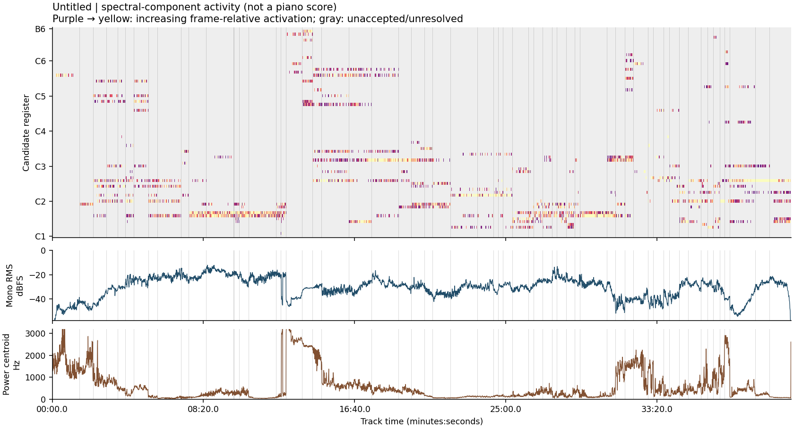

## Machine-readable representation and optimization

The companion `study.json` contains all sections, source hashes, proposed patches, analytical interpretations and raw candidate events. Each track has three arrays in `data/`: the original feature NPZ; a 20-ms envelope NPZ; and a target NPZ with support masks, local frequency targets and normalization constants. A compact `sections.csv` and a long `pitch_components.csv` make the same evidence accessible without parsing nested JSON. `candidate_events.csv` contains sustained candidate regions, not MIDI transcription.

### Target semantics

`target_relative_activation` is the harmonic-template activation divided by the maximum activation in each half-second frame. `target_support_mask` requires a supported narrow component somewhere in that analysis window, framewise direct-fundamental support above 8% of the largest direct component, relative activation above 0.28, and mono RMS above −55 dBFS. This is a **spectral-component mask**, not a probability that a performed note exists. Its zero values mean “not accepted as a target by this heuristic,” not “known absent note.” The selected peak's frequency and cents are section-averaged constants: no continuous pitch-bend contour has been recovered.

`target_frequency_hz` is zero outside that mask. Inside, it holds the independently estimated local peak frequency. `target_weight` multiplies relative activation by a capped local-prominence factor, `clip(prominence_dB/24,0,1)`. This factor is a proposed optimization weight, not statistical confidence. Per-frame labels have `instrument_ground_truth = null`, `meter_ground_truth = null`, and `score_note_ground_truth = null` in the metadata. All key-profile fits remain auxiliary metadata.

Features are **pitch × time**, with MIDI numbers given explicitly. Pitch frame t covers approximately `[0.5t,0.5(t+1))` seconds, clipped to track length. CQT windows and the temporal median filter smear attacks; do not evaluate note-onset error at sub-frame precision. Envelope samples are 20-ms block RMS values positioned at block start; the final incomplete block is omitted. The waveform's phase is not stored in those envelopes.

### Suggested fitting objective

For a rendered candidate, run the same feature extraction at the same sample rate. Begin with a proposed normalized loss:

`L = 0.35 L_component + 0.20 L_log_envelope + 0.15 L_chroma + 0.15 L_power_centroid + 0.10 L_side_mid + 0.05 L_flatness`

Use masked, weight-normalized mean absolute error for the component term; compare log envelopes at 20 ms after gain alignment; use cosine distance for chroma; compare log2 centroid; compare side/mid and log flatness after robust scaling. Fit robust scaling on the training partition only. These weights are starting values, not empirically optimized results. No model was trained and no reconstruction quality score is claimed here.

Fit pitch centers and register before grain timing, then source envelope, then distortion/noise, then spatial balance. Keep gain as an explicit nuisance parameter so that a louder render does not appear structurally better. For a stable harmonic window, a practical proposed target is within about 0.5 Hz below 200 Hz and within 5–10 cents above it, subject to source resolution and observed beating; do not force unstable partials to meet a false exactness criterion.

Do not supervise named chords from every profile maximum. A G/Ab drone can alternate G-minor and Ab-major classifier outputs without a corresponding musical modulation. Likewise, optimizing only centroid permits the wrong notes to achieve a superficially similar spectrum. For noisy windows with no supported components, omit the pitched-component term and renormalize the remaining loss terms.

### Dataset split and leakage

Split by source family, not randomly by neighboring time windows. Group the matched Celestina, Counter Attack and Balkanize-You studio/live spans into the same partition, and keep adjacent windows together. Otherwise the live material can leak the studio source into validation. Use uncertain matches as potential leakage groups until disproven. The 22 recordings are a small reference corpus, not evidence of a generalizable training set; broadening it requires separately documented examples.

### Verification performed

Three synthetic known-note probes recovered the expected top pitches: clean Cm (C3/Eb3/G3), noisy Cm, and a distorted F2/C3 fifth. A white-noise probe produced spurious raw pitch/key candidates but zero sections passing the narrow-peak support gate. This demonstrates why the gate is necessary; four toy tests do **not** measure accuracy on the albums. No annotated ground-truth score, separated stems or original project files were available. The archive includes these results and the actual analysis scripts.

## Reproducibility and scope of remaining uncertainty

The pipeline uses librosa CQT with 252 bins at 36 bins/octave from C1, 0.5-second median aggregation, local spectral-floor subtraction, and nonnegative least squares against eight-partial harmonic templates. MIDI candidates span C1–B6. A second averaged-spectrum check accepts candidates with at least 6 dB local prominence and direct-fundamental support in at least 25% of the section frames. Both tests can still accept a harmonic or an intermodulation product. They are not source separation.

Pitch classes are correlated with major/minor profiles. The stored correlation is similarity to that template, not key confidence. Temporal novelty combines pitch distribution, five spectral bands, level, power centroid and stereo ratio over approximately eight-second contexts. The script inserts 90-second analysis caps. Peak and tuning measurements average over the window and can conceal moving or doubled components.

Live retrieval compares 30-second feature windows, with studio rates 0.75, 1, 1.25 and 1.5 seconds per live second. Its score combines 60% absolute feature similarity and 40% centered temporal-shape similarity. The retained top three candidates per live window are not accepted matches by default. The waveform checks then test selected candidates. Neither stage has an empirical false-match probability for this repertoire.

The source assumptions and code are included so these decisions can be inspected. A full original-note transcription, exact note velocities, original synth patches, grain lengths, reverb impulse responses and complete stem identities remain unestablished. The document supplies concrete frequency, register, timing and signal-shaping targets where the data supports them, and keeps those unresolved variables explicit rather than inventing an authoritative session.

For comparison with an independently written formal analysis, Brett Bergmann divides Spectral into seven large sections. That perceptual segmentation and the smaller acoustic windows here answer different questions. [Global Movement, Local Detail](https://econtact.ca/11_2/bergmann_hecker.html).

Technical implementation reference: [librosa 0.11 CQT](https://librosa.org/doc/0.11.0/generated/librosa.cqt.html). The included scripts are the definitive description of this extraction run.
